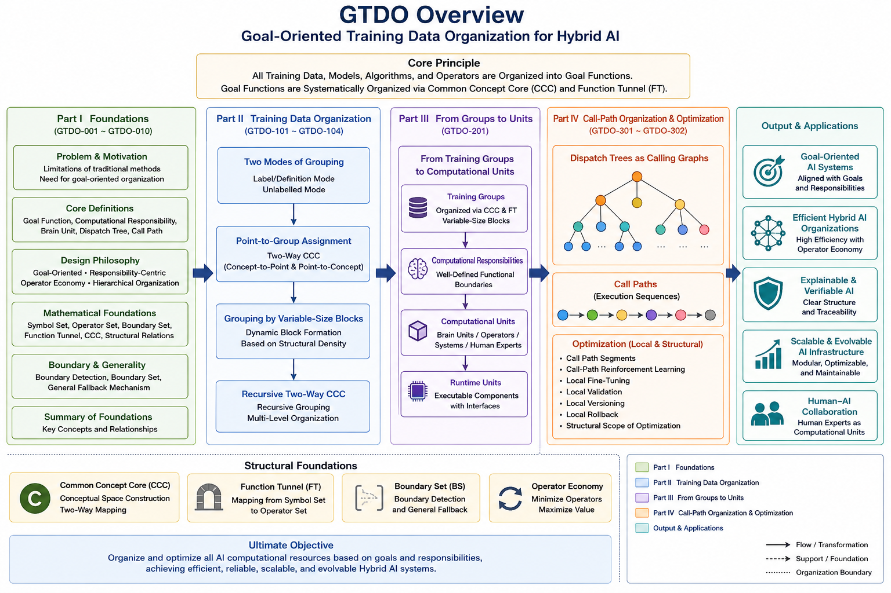
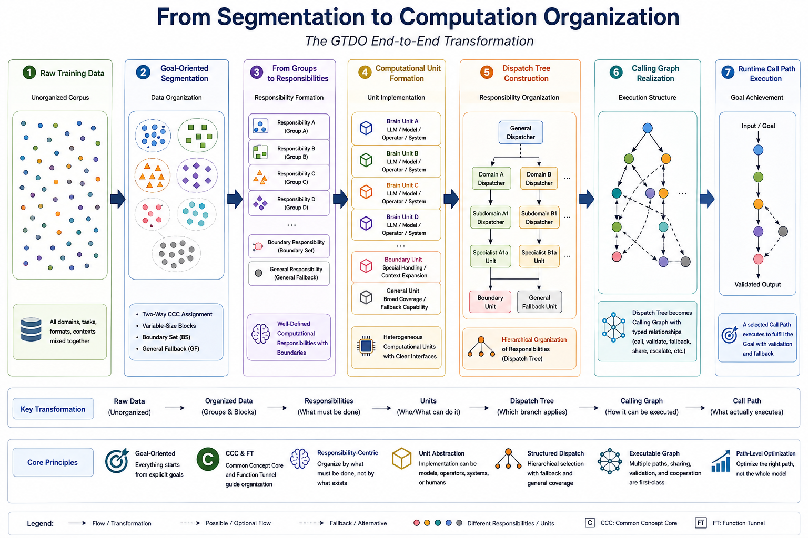
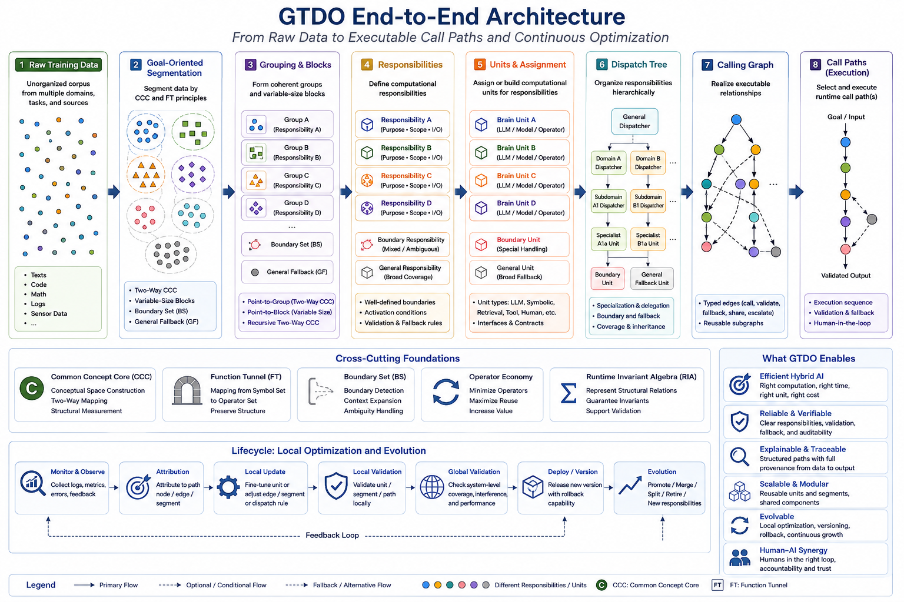
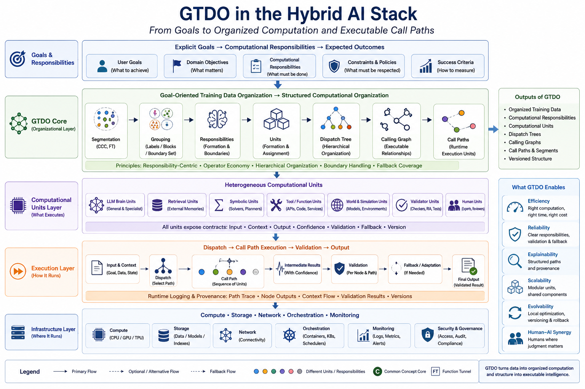
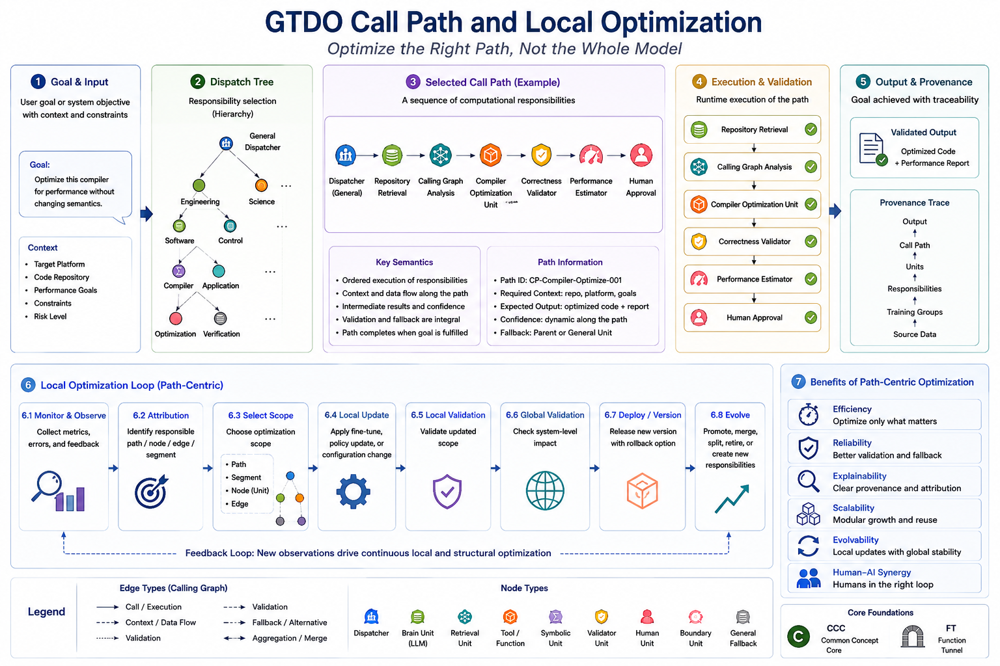
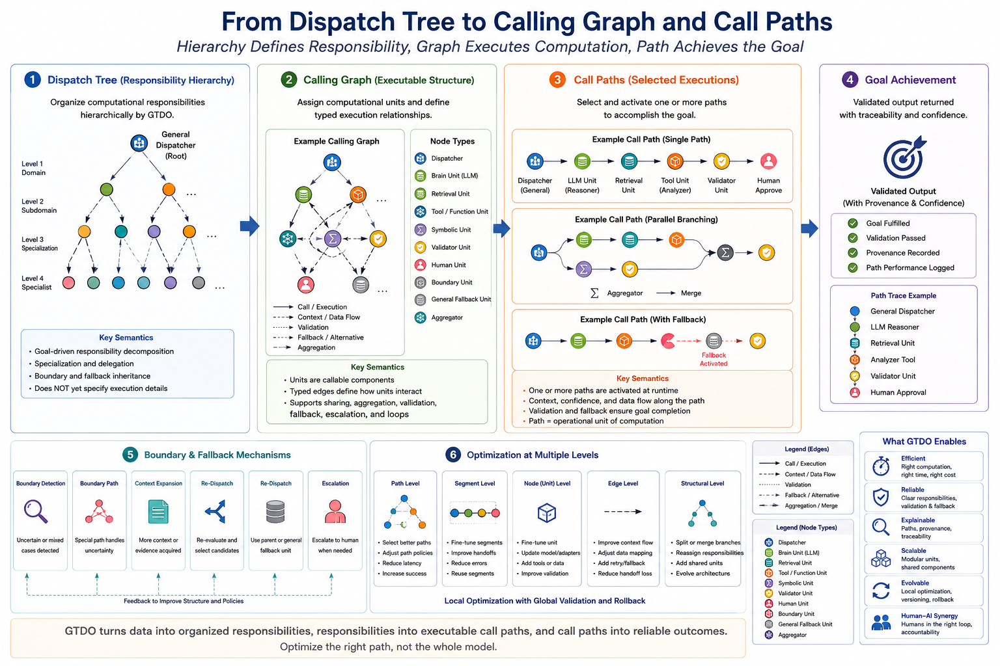

# Goal-Oriented Training Data Organization (GTDO)

## From Training Data Organization to Runtime Computational Organization

---

#### Fig-000-GTDO-Overview.png


---

**Goal-Oriented Training Data Organization (GTDO)** proposes a structural approach to AI computation in which training data are organized according to future computational goals rather than statistical similarity alone.

Instead of viewing datasets as passive collections of samples, GTDO treats them as the organizational foundation of future Runtime AI systems. Training groups become computational units, computational units become Brain Units, and Brain Units cooperate through dispatch, calling graphs, and localized Runtime optimization.

GTDO therefore extends the role of training data from model preparation to computational organization.

---

## Quick Navigation

- [Start Here](./docs/START-HERE.md)
- [Contents](./docs/CONTENTS.md)
- [Figure Index](./docs/FIGURE-INDEX.md)
- [Roadmap](./docs/ROADMAP.md)
- [Part I — Foundations](./docs/Part-I-Foundations/README.md)
- [Part II — Core Grouping Algorithms](./docs/Part-II-Core-Grouping-Algorithms/README.md)
- [Part III — Brain Unit Organization](./docs/Part-III-Brain-Unit-Organization/README.md)
- [Part IV — Call Path Optimization](./docs/Part-IV-Call-Path-Optimization/README.md)

---

## Repository Overview

This repository presents a unified framework that connects:

- Goal-oriented data organization
- Computational grouping algorithms
- Brain Unit architectures
- Runtime dispatch
- Calling Graphs and Call Paths
- Local Runtime optimization
- Structural Security Infrastructure

Together these components establish an organizational foundation for future Runtime AI.

---

## Why GTDO?

---

#### Fig-001-From-Segmentation-to-Computation-Organization.png


---

Current AI systems primarily organize training data according to statistical similarity.

While highly successful for large-scale representation learning, such approaches often provide limited support for:

- explicit computational organization;
- heterogeneous AI architectures;
- localized Runtime optimization;
- structural responsibility;
- explainable execution;
- trustworthy Runtime governance.

GTDO introduces a different perspective.

Instead of asking

> **Which data are statistically similar?**

GTDO asks

> **Which data should cooperate to accomplish a computational goal?**

This seemingly small shift changes the role of training data throughout the entire AI lifecycle.

Training organization becomes computation organization.

---

# Core Philosophy

GTDO is founded upon a simple principle:

> **Organize computation before optimization, and structurally organize Runtime AI before it can become trustworthy.**

This principle extends across all four Parts of this repository.

Training organization becomes Brain Unit organization.

Brain Unit organization enables Runtime dispatch.

Runtime dispatch enables Calling Graphs.

Calling Graphs enable localized optimization.

Localized optimization enables trustworthy Runtime AI.

---

# Contributions

GTDO introduces several structural concepts for Runtime AI.

## 1. Goal-Oriented Training Organization

Training data are organized according to future computational objectives instead of purely statistical similarity.

---

## 2. Computational Organization

Training groups become reusable computational organizations.

---

## 3. Brain Units

Goal-oriented computational groups evolve into heterogeneous Brain Units with explicit responsibilities.

---

## 4. Dispatch-Centered Runtime

Runtime computation becomes a dispatch problem rather than a monolithic inference problem.

---

## 5. Calling Graphs and Call Paths

Execution is represented as explicit organizational structures that support optimization, auditing, and continual improvement.

---

## 6. Local Runtime Learning

Optimization becomes localized.

Individual Call Paths can evolve independently without retraining the entire system.

---

## 7. Structural Security Infrastructure

GTDO demonstrates that trustworthy AI begins with structural organization.

Security is no longer treated as an external filter added after computation.

Instead,

structural isolation,

dispatch,

organizational boundaries,

and Runtime validation

become intrinsic properties of computational organization.

---

# Repository Structure

The repository is organized into four progressively connected Parts.

```
Part I
Foundations

        ↓

Part II
Core Grouping Algorithms

        ↓

Part III
Brain Unit Organization

        ↓

Part IV
Call Path Optimization
```

Each Part builds directly upon the previous one.

Together they describe a complete organizational pipeline from training data to trustworthy Runtime AI.

---

# Reading Guide

Different readers may choose different reading paths.

### AI Researchers

Part I

↓

Part II

↓

Part III

↓

Part IV

---

### AI Engineers

Part II

↓

Part III

↓

Part IV

---

### Runtime AI Researchers

Part III

↓

Part IV

↓

Related repositories (SRAI, FTRIA, RI)

---

### Readers Interested in Trustworthy AI

GTDO-203

↓

GTDO-207

↓

GTDO-301

↓

GTDO-309

↓

GTDO-310

---

# Figures

The repository contains overview figures together with Part-specific illustrations that progressively explain GTDO from foundational concepts to Runtime optimization and structural security.

A complete figure list is available in

**docs/FIGURE-INDEX.md**

---

# Repository Knowledge Map

---

#### Fig-003-GTDO-End-to-End-Architecture.png


---

GTDO is organized as four progressively connected Parts.

Each Part answers a different layer of the same fundamental question:

> **How should future AI computation be organized?**

# Part I — Foundations

**Structural principles behind Goal-Oriented Training Data Organization.**

Part I establishes the conceptual foundation of GTDO.

It explains why future AI systems should organize training data according to computational goals rather than statistical similarity alone, and introduces the structural principles that guide the remainder of the repository.

Contents include:

- Why Goal-Oriented Training Data Organization
- From Data Segmentation to AI Computation Organization
- Goal Functions and RHS-Driven Training Organization
- Dispatch Is Not Segmentation
- Training Data Organization as Computation Organization
- Computational Responsibility
- Dispatch and Organizational Semantics
- Context as an Organizational Dimension
- Boundary Sets
- Summary of Foundations

Representative figures:

- Fig-010 — Part I Overview
- Fig-101 — GTDO Structural Overview

---

# Part II — Core Grouping Algorithms

**Algorithms for computational grouping, dispatch, and boundary construction.**

Part II translates the conceptual principles into practical computational algorithms.

Rather than grouping data solely according to similarity, GTDO develops algorithms that organize data according to future Runtime computation.

Topics include:

- Two Modes of Goal-Oriented Grouping
- Two-Way CCC Assignment
- Variable-Size Block Grouping
- Recursive Two-Way CCC
- Boundary Resolution
- Goal Function Engineering
- Multi-Level Dispatch
- Significance and Confidence

Representative figures:

- Fig-020 — Part II Overview
- Fig-102 — Hybrid Computational Organization
- Fig-103 — Runtime Execution Flow

---

# Part III — Brain Unit Organization

**Building heterogeneous computational organizations.**

Part III introduces one of the central ideas of GTDO:

Training groups evolve into computational organizations.

These organizations become Brain Units capable of cooperating within larger Runtime AI systems.

Topics include:

- Computational Units
- Heterogeneous Units
- Brain Units
- Boundary Brain Units
- General Fallback Units
- Computational Responsibility Graphs
- Dispatch Trees
- Dispatch Graphs
- Hybrid Computational Organizations

Representative figures:

- Fig-030 — Part III Overview
- Fig-104 — Organizational Relationships
- Fig-105 — Dispatch Tree Example
- Fig-108 — Organizational Boundaries
- Fig-109 — Hybrid AI Ecosystem

---

# Part IV — Call Path Optimization

**Runtime execution, local optimization, and structural trust.**

Part IV focuses on Runtime execution after computational organizations have been established.

Execution is modeled as Calling Graphs, Call Paths, and localized optimization cycles that support continual improvement while preserving organizational stability.

Topics include:

- Dispatch Trees as Calling Graphs
- Call Paths
- Call Path Segments
- Call-Path Reinforcement Learning
- Local Fine-Tuning
- Local Validation
- Local Versioning
- Local Rollback
- Structural Scope of Optimization
- GTDO as the Structural Security Infrastructure for AI Runtime

Representative figures:

- Fig-040 — Part IV Overview
- Fig-106 — Call Path Segment Structure
- Fig-107 — Calling Graph vs Call Path
- Fig-110 — Continuous Improvement Lifecycle
- Fig-111 — Optimization Structural Scope
- Fig-112 — Local Learning and Adaptation
- Fig-113 — Data and Knowledge Flow
- Fig-114 — Structural Organization as the Foundation of Trustworthy AI Runtime

---

# Evolution Across the Repository

The four Parts form one continuous organizational evolution.

```
Training Data

        ↓

Goal Functions

        ↓

Grouping Algorithms

        ↓

Brain Units

        ↓

Dispatch

        ↓

Calling Graphs

        ↓

Call Paths

        ↓

Local Learning

        ↓

Runtime Validation

        ↓

Structural Security Infrastructure
```

Each stage naturally enables the next.

GTDO therefore describes an organizational evolution rather than a collection of isolated algorithms.

---

# Recommended Reading Paths

## Path A — Understanding GTDO

Recommended for first-time readers.

Part I

↓

Part II

↓

Part III

↓

Part IV

---

## Path B — AI Architecture

For readers interested in Brain Unit architectures and Hybrid AI.

GTDO-005

↓

GTDO-107

↓

GTDO-203

↓

GTDO-207

↓

GTDO-209

---

## Path C — Runtime Optimization

For AI Runtime engineers.

GTDO-207

↓

GTDO-301

↓

GTDO-302

↓

GTDO-304

↓

GTDO-309

---

## Path D — Trustworthy Runtime AI

For readers interested in trustworthy AI systems.

GTDO-203

↓

GTDO-206

↓

GTDO-207

↓

GTDO-306

↓

GTDO-309

↓

GTDO-310

---

# Relationship to Other Repositories

---

#### Fig-002-GTDO-in-the-Hybrid-AI-Stack.png


---

GTDO complements several repositories within the Structural Runtime AI research ecosystem.

| Repository | Primary Focus |
|------------|---------------|
| **SRAI** | Runtime Intelligence and Structural AI |
| **FTRIA** | Function Tunnels and Runtime Invariants |
| **RI** | Runtime Invariant theory |
| **SRMS** | Structural Recognition above Metric Similarity |
| **IJS** | Information Job Shop and Computational Organization |

Together these repositories describe complementary layers of future Runtime AI systems, from structural recognition and runtime invariants to computational organization and trustworthy execution.

---

# Future Directions

---

#### Fig-005-GTDO-Call-Path-and-Local-Optimization.png


---

GTDO establishes an organizational perspective for Runtime AI.

Rather than viewing AI systems as monolithic models, GTDO proposes that future intelligence will emerge from computational organizations composed of specialized Brain Units, explicit dispatch mechanisms, localized Runtime optimization, and structurally organized execution.

Many important research directions naturally extend from this foundation.

Examples include:

- Runtime Structural Interaction
- Trustworthy Runtime AI
- Runtime Governance
- Structural Security Infrastructure
- Runtime Invariant Validation
- Brain Unit Collaboration
- Hybrid Human–AI Organizations
- Collective Runtime Intelligence
- Autonomous Computational Organizations

GTDO does not attempt to solve all of these problems.

Instead, it establishes the organizational infrastructure upon which they can be systematically investigated.

---

# GTDO within the Structural Runtime AI Ecosystem

GTDO is one component of a broader Structural Runtime AI research program.

Each repository addresses a different structural layer of intelligent computation.

| Repository | Primary Contribution |
|------------|----------------------|
| **SRMS** | Structural Recognition above Metric Similarity |
| **RI** | Runtime Invariants |
| **FTRIA** | Runtime Invariant Algebra and Function Tunnels |
| **SRAI** | Structural Runtime Intelligence |
| **GTDO** | Goal-Oriented Computational Organization |
| **IJS** | Information Job Shop and Organizational Computation |

These repositories are intentionally complementary.

Together they describe a progression from structural recognition to Runtime organization, localized optimization, and trustworthy AI execution.

---

# Key Principles

GTDO is guided by several recurring principles.

## Organization Before Optimization

Computational organization should precede optimization.

Optimization without organization often produces complexity without scalability.

---

## Dispatch Before Execution

Execution should occur only after explicit organizational dispatch.

Dispatch transforms computation from uncontrolled inference into organized Runtime execution.

---

## Locality Before Globality

Whenever possible, optimization should remain local.

Localized adaptation improves efficiency, explainability, maintainability, and continual evolution.

---

## Structural Isolation Before Trust

Trustworthy Runtime AI begins with explicit computational boundaries.

Structural organization enables:

- responsibility assignment;
- localized validation;
- controlled execution;
- Runtime governance;
- trustworthy AI systems.

---

# Repository Highlights

---

#### Fig-004-From-Dispatch-Tree-to-Calling-Graph-and-Call-Paths.png



---

This repository introduces several organizational concepts that distinguish GTDO from conventional training methodologies.

Highlights include:

- Goal-oriented computational grouping
- Goal Function Engineering
- Multi-Level Dispatch
- Brain Units
- Boundary Brain Units
- Computational Responsibility Graphs
- Dispatch Trees
- Dispatch Graphs
- Calling Graphs
- Call Paths
- Local Runtime Learning
- Structural Scope of Optimization
- Structural Security Infrastructure

Together these concepts transform training data organization into Runtime computational organization.

---

# Citation

If this repository contributes to your research, please consider citing it using the accompanying **CITATION.cff** file or the DOI associated with the official release.

Citation metadata are also provided in:

- `CITATION.cff`
- `.zenodo.json`

---

# Acknowledgements

GTDO is part of an ongoing exploration of Structural Runtime AI.

Many concepts presented here evolved through continual interaction among structural recognition, Runtime organization, Function Tunnel theory, Runtime Invariants, Brain Units, Calling Graphs, and Hybrid AI architectures.

The repository reflects an incremental research philosophy:

Small structural improvements accumulate into larger organizational capabilities.

---

# Concluding Remarks

Artificial Intelligence has achieved remarkable progress through larger models, larger datasets, and increased computational power.

GTDO explores a complementary direction.

Rather than asking only

> **How can models become larger?**

GTDO asks

> **How should computation itself be organized?**

This shift transforms the role of training data.

Training data become computational organizations.

Computational organizations become Brain Units.

Brain Units cooperate through dispatch.

Dispatch creates Calling Graphs.

Calling Graphs generate Call Paths.

Call Paths enable localized learning.

Localized learning supports Runtime validation.

Runtime validation establishes the organizational foundation for trustworthy AI.

The resulting progression is

```
Training Data

↓

Goal Functions

↓

Computational Organization

↓

Brain Units

↓

Dispatch

↓

Calling Graphs

↓

Call Paths

↓

Local Runtime Learning

↓

Runtime Validation

↓

Structural Security Infrastructure

↓

Trustworthy Runtime AI
```

GTDO therefore proposes that trustworthy AI begins not with larger models, but with better organization.

**Organize computation before optimization.**

**Structurally organize Runtime AI before it can become trustworthy.**

---

## Author

Sizhe Tan\
Independent Researcher

GPT-Obot\
AI Research Assistant

2026

## Citation

DOI: 10.5281/zenodo.21614134

## License

Apache-2.0

---

## 📚 DBM-SI Series Navigation

See:\
[./docs/DBM-SI-Series-of-gitHub-Repositories/DBM-SI-Series-of-gitHub-Repositories.md](./docs/DBM-SI-Series-of-gitHub-Repositories/DBM-SI-Series-of-gitHub-Repositories.md)

[./docs/DBM-SI-Series-of-gitHub-Repositories/DBM-SI-Structural-Intelligence-Dictionary-(v2).md](./docs/DBM-SI-Series-of-gitHub-Repositories/DBM-SI-Structural-Intelligence-Dictionary-(v2).md)

