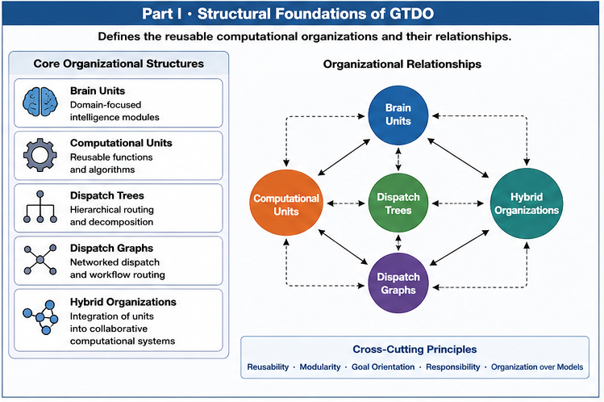
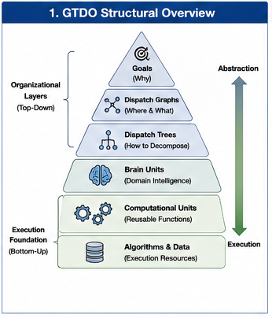

# GTDO-001 — Why Goal-Oriented Training Data Organization

## From Data Segmentation to General AI Computation Organization

---

#### Fig-010-Part-I-Structural-Foundatiobs-of-GTDO.png



---

## Abstract

Modern AI systems are typically trained using enormous collections of data that undergo cleaning, tokenization, sampling, and optimization before being presented to a learning algorithm. This pipeline has enabled remarkable progress, particularly for large language models (LLMs). Nevertheless, the overwhelming majority of current training workflows still treat the training corpus as a largely unified computational object.

This repository begins with a different question.

Instead of asking **how to train a larger model**, we ask:

> **How should training data be organized so that future AI computation becomes more specialized, more controllable, more efficient, and more evolvable?**

Goal-Oriented Training Data Organization (GTDO) proposes that training-data organization should itself become an explicit layer of AI system architecture rather than a preprocessing step hidden inside a training pipeline.

---

#### Fig-101-GTDO-Structural-Overview.png



---

# 1. Motivation

Current AI training pipelines usually follow a structure similar to:

```text
Raw Training Data
        ↓
Cleaning
        ↓
Tokenization
        ↓
Sampling
        ↓
Training
        ↓
One Model
```

Although many improvements have been proposed for optimization algorithms, model architectures, attention mechanisms, and hardware acceleration, comparatively little attention has been paid to the organization of training data itself as an engineering discipline.

Training data is often regarded as something that should simply be collected, cleaned, and scaled.

GTDO argues that this viewpoint overlooks an important opportunity.

Training data is not merely information.

It is the future source of computational capability.

Therefore, organizing training data is fundamentally an act of organizing future computation.

---

# 2. The Central Observation

Suppose a large training corpus contains information belonging to many different computational responsibilities.

Examples include:

* software engineering;
* compiler optimization;
* mathematical reasoning;
* medical diagnosis;
* legal analysis;
* scientific explanation;
* conversational interaction.

Conventional training generally combines these responsibilities into a common optimization process.

GTDO asks a different question.

Instead of beginning with one unified optimization objective, we ask:

> Which computational responsibilities actually exist inside the training data?

Once these responsibilities become explicit, many new possibilities emerge.

Training data can be organized according to future computational roles rather than remaining an undifferentiated corpus.

---

# 3. From Data to Computation

The central transformation proposed by GTDO is

```text
Training Data
        ↓
Goal-Oriented Organization
        ↓
Computational Responsibility
        ↓
Computational Units
        ↓
AI Computation Organization
```

This transformation changes the meaning of training-data preparation.

Training organization is no longer only about preparing examples.

It becomes part of the computational architecture itself.

---

# 4. Why Goal Orientation Matters

Many existing grouping or clustering techniques attempt to discover statistical similarity.

GTDO begins somewhere else.

Every organizational decision should answer a simple question:

> **What computational goal does this organization serve?**

A grouping that produces elegant statistical clusters but contributes little to future computation may have limited engineering value.

Conversely, two structurally different groups may deserve separate computational treatment even if they remain relatively close in conventional embedding space.

Goal orientation therefore precedes grouping.

Grouping is a means.

Computation organization is the objective.

---

# 5. Segmentation Is Not Enough

GTDO intentionally distinguishes between **segmentation** and **organization**.

Segmentation asks:

> Where should data be divided?

Organization asks:

> Which computational structure should take responsibility for this data?

This distinction is fundamental.

Segmentation creates boundaries.

Organization creates computational responsibilities.

For example, two samples located far apart inside a corpus may still belong to exactly the same computational responsibility.

Likewise, one continuous document may legitimately contain several independent computational responsibilities.

Therefore, segmentation alone cannot describe future computation.

GTDO introduces **dispatch** as the missing concept connecting organized data with organized computation.

---

# 6. Dispatch Creates Computational Responsibility

Within GTDO, dispatch does not merely mean routing data to an execution destination.

Dispatch means assigning computational responsibility.

Conceptually,

```text
Training Data
        ↓
Structural Recognition
        ↓
Grouping
        ↓
Dispatch
        ↓
Computational Responsibility
```

The result is not simply several datasets.

The result is an explicit computational organization capable of supporting specialization, validation, local optimization, and future evolution.

---

# 7. Beyond Large Language Models

Although LLMs provide an immediate and practical application of GTDO, they are not its theoretical boundary.

The same organizational principles naturally apply to many heterogeneous computational structures, including:

* language models;
* world models;
* vision systems;
* symbolic reasoning engines;
* search algorithms;
* planning systems;
* retrieval systems;
* software functions;
* control modules;
* simulation engines;
* AI agents;
* human experts.

Accordingly, GTDO should be understood as a framework for **general AI computation organization**, not merely as an LLM training technique.

---

# 8. Computational Responsibility

GTDO introduces **Computational Responsibility** as a first-class engineering concept.

Instead of asking only:

> Which data belong together?

GTDO asks:

> Which future computational capability should own this responsibility?

Examples include:

* solving compiler optimization problems;
* validating mathematical reasoning;
* handling ambiguous inputs;
* retrieving external knowledge;
* coordinating multiple computational units;
* providing general fallback capability.

Training groups become meaningful when they correspond to recognizable computational responsibilities.

---

# 9. Two Fundamental Organization Modes

GTDO recognizes two complementary organization modes.

## Point-to-Group Assignment

Individual samples may be assigned to a common group even when they are widely separated inside the original dataset.

This mode emphasizes structural responsibility rather than positional continuity.

The primary GTDO algorithm for this mode is:

> **Two-Way Common Concept Core (Two-Way CCC).**

---

## Point-to-Block Grouping

Some applications require grouped data to preserve continuity.

Examples include:

* document regions;
* temporal intervals;
* code blocks;
* ordered context windows.

The primary GTDO algorithm for this mode is:

> **Variable-Size Blocks Indexing and Searching.**

Together these two organization modes provide the computational foundation of GTDO.

---

# 10. Boundary Sets Are Expected

Real-world data rarely separate perfectly.

Some samples naturally belong to transitional, mixed, or uncertain regions.

GTDO therefore introduces the concept of the **Boundary Set**.

Rather than treating unresolved samples as failure, GTDO considers them important computational objects that may lead to:

* recursive organization;
* Boundary Brain Units;
* fallback computation;
* multi-path dispatch;
* future computational responsibilities.

Boundary processing is therefore an essential architectural component rather than a post-processing detail.

---

# 11. From Organization to Hybrid AI

Once computational responsibilities become explicit, they can support the formation of specialized computational units.

These units may be organized into:

* Dispatch Trees;
* Dispatch Graphs;
* Call Paths;
* Hybrid AI architectures.

The progression becomes

```text
Training Data
        ↓
Goal-Oriented Organization
        ↓
Computational Responsibility
        ↓
Computational Units
        ↓
Dispatch Trees
        ↓
Call Paths
        ↓
Localized Optimization
        ↓
Hybrid AI Organization
```

Thus, GTDO naturally connects training-time organization with runtime computation.

---

# 12. A Control Engineering Perspective

GTDO views AI training as a control-engineering problem.

Instead of relying primarily on increasingly larger unified optimization processes, GTDO attempts to expose explicit organizational structures that can be:

* inspected;
* measured;
* validated;
* locally optimized;
* versioned;
* rolled back;
* evolved independently.

The objective is not merely higher accuracy.

The objective is better organizational controllability.

---

# 13. Relationship to Existing GTDO Algorithms

GTDO is intentionally built upon structural algorithms developed previously.

In particular:

* **Two-Way CCC** provides the principal mechanism for Point-to-Group Assignment.

* **Variable-Size Blocks Indexing and Searching** provides the principal mechanism for Point-to-Block Grouping.

Rather than replacing these algorithms, GTDO places them within a broader computational-organization framework.

---

# 14. Long-Term Vision

The long-term objective of GTDO is considerably broader than improving one model architecture.

It seeks to establish a general methodology for organizing future AI computation.

The desired progression is

```text
Training Data
        ↓
Goal-Oriented Organization
        ↓
Computational Responsibility
        ↓
Computational Units
        ↓
Dispatch Trees and Graphs
        ↓
Call Paths
        ↓
Localized Optimization
        ↓
Runtime Hybrid AI
        ↓
General AI Computation Organization
```

As AI systems become increasingly heterogeneous, distributed, and collaborative, explicit computation organization may become as important as model architecture itself.

GTDO aims to contribute to that transition.

---

# Key Takeaways

* Training data should be viewed as the source of future computational capability rather than merely a collection of examples.
* Goal orientation should precede grouping and dispatch.
* Segmentation and computation organization are fundamentally different concepts.
* Dispatch assigns computational responsibility rather than merely routing data.
* GTDO is not limited to LLMs; it is intended as a framework for general AI computation organization.
* Point-to-Group Assignment and Point-to-Block Grouping form the two complementary organizational foundations of GTDO.
* Boundary Sets are expected outcomes that deserve explicit computational treatment.
* GTDO connects training-data organization directly to Hybrid AI architectures through computational responsibilities, computational units, Dispatch Trees, and Call Paths.

---

## Further Reading

**Foundational GTDO**

* GTDO-002 — *From Data Segmentation to AI Computation Organization*
* GTDO-003 — *Goal Functions and RHS-Driven Training Organization*
* GTDO-004 — *Dispatch Is Not Segmentation*

**Related Structural Runtime AI (SRAI)**

* SRAI-101 — *Structure Difference Trees*
* SRAI-108 — *Structural Recognition Above Metric Similarity*
* SRAI-208 — *Runtime Organization*
* SRAI-302 — *Runtime Invariant Algebra*
* SRAI-303 — *Runtime Organization Algebra*

**Related Structural Foundations**

* **Structural Recognition above Metric Similarity (SRMS)**
* **Function Tunnel and Runtime Invariant Algebra (FTRIA)**
