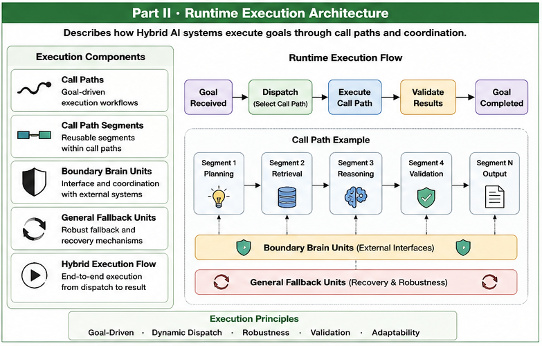

# Part II — Core Grouping Algorithms

# Computational Organization Through Goal-Oriented Grouping

Welcome to **Part II** of the **Goal-Oriented Training Data Organization (GTDO)** repository.

Part I established the conceptual foundations of Goal-Oriented Training Data Organization.

Part II transforms these principles into computational algorithms.

Rather than grouping data solely according to statistical similarity, GTDO develops algorithms that organize data according to future computational goals.

Grouping therefore becomes the first step toward Runtime computational organization.

---

# Overview

#### Fig-020-Part-II-Core-Grouping-Algorithms.png


**Figure 020** summarizes the computational organization algorithms introduced in this Part.

These algorithms provide the bridge between conceptual organization and future Runtime execution.

---

# Why This Part Matters

Traditional clustering algorithms typically answer questions such as:

- Which samples are similar?
- Which cluster minimizes distance?
- Which partition maximizes statistical consistency?

GTDO addresses a different question.

> **Which data should cooperate to accomplish a future computational goal?**

The distinction is fundamental.

The objective is no longer merely grouping data.

The objective becomes organizing future computation.

This shift changes the purpose of grouping itself.

---

# What You Will Learn

After completing this Part, readers should understand:

- why goal-oriented grouping differs from conventional clustering;
- how Two-Way CCC supports computational assignment;
- why variable-size computational groups are advantageous;
- how Recursive Two-Way CCC enables hierarchical organization;
- how Boundary Resolution improves organizational robustness;
- how Goal Function Engineering guides computational structures;
- how Multi-Level Dispatch organizes Runtime execution;
- how Significance and Confidence influence organizational decisions.

These algorithms establish the computational infrastructure upon which Brain Units are later constructed.

---

# Articles

| ID | Title |
|----|-------|
| **GTDO-101** | Two Modes of Goal-Oriented Grouping |
| **GTDO-102** | Point-to-Group Assignment by Two-Way CCC |
| **GTDO-103** | Point-to-Block Grouping by Variable-Size Blocks |
| **GTDO-104** | Recursive Two-Way CCC |
| **GTDO-105** | Boundary Resolution |
| **GTDO-106** | Goal Function Engineering |
| **GTDO-107** | Multi-Level Dispatch |
| **GTDO-108** | Significance and Confidence |

---

# Reading Suggestions

The following sequence is recommended.

```
GTDO-101

↓

GTDO-102

↓

GTDO-103

↓

GTDO-104

↓

GTDO-105

↓

GTDO-106

↓

GTDO-107

↓

GTDO-108
```

The articles gradually evolve from computational grouping to Runtime dispatch.

---

# Relationship to Other Parts

Part II serves as the computational bridge connecting conceptual foundations with Runtime organizations.

```
Part I

Foundations

        ↓

Part II

Core Grouping Algorithms

        ↓

Part III

Brain Unit Organization

        ↓

Part IV

Call Path Optimization
```

Without these grouping algorithms, Brain Units would remain conceptual entities rather than operational computational organizations.

---

# Key Contributions

Part II introduces several computational concepts that distinguish GTDO from conventional machine learning pipelines.

Highlights include:

- Goal-Oriented Grouping
- Two-Way CCC Assignment
- Variable-Size Computational Blocks
- Recursive Organizational Construction
- Boundary Resolution
- Goal Function Engineering
- Multi-Level Dispatch
- Confidence-Based Organizational Decisions

Together these methods transform grouping into organizational computation.

---

# Relationship to Runtime AI

Although these algorithms are introduced during training organization, their purpose extends far beyond training.

The organizational structures constructed here later evolve into:

- Brain Units;
- Dispatch Trees;
- Computational Responsibility Graphs;
- Calling Graphs;
- Runtime execution paths.

Part II therefore establishes the computational bridge between training organization and Runtime AI.

---

# Key Takeaways

Part II establishes several important principles.

- Grouping should be guided by computational goals rather than similarity alone.
- Organizational structure is more important than fixed cluster boundaries.
- Goal Functions organize future computation.
- Dispatch emerges naturally from organizational grouping.
- Computational organizations become reusable Runtime assets.

These principles prepare the transition toward Brain Unit architectures.

---

# Continue Your Journey

After completing **Part II**, continue to:

> **Part III — Brain Unit Organization**

where computational groups evolve into heterogeneous Brain Units capable of cooperating within larger Runtime AI systems.

The transition from Part II to Part III represents the evolution from **computational algorithms** to **computational organizations**.