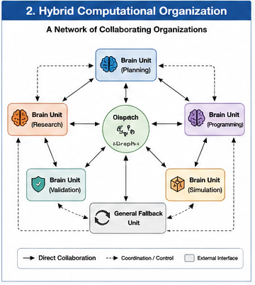
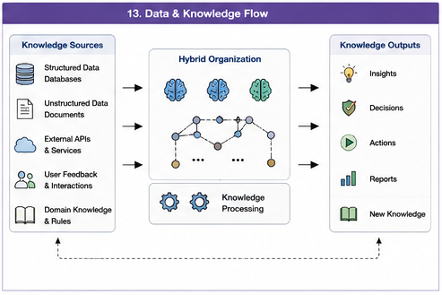

# GTDO-201 — From Training Groups to Computational Units

## How Goal-Oriented Data Organization Becomes Executable AI Computation Organization

---

## Abstract

Goal-Oriented Training Data Organization does not end when training data has been divided into groups, blocks, Boundary Sets, or fallback collections.

Those structures are only intermediate organizational artifacts.

The deeper question is:

> **How does an organized training group become an executable Computational Unit?**

A training group contains evidence.

A Computational Unit accepts responsibility.

The transition between them requires an explicit intermediate layer:

```text
Training Group
        ↓
Responsibility Candidate
        ↓
Validated Computational Responsibility
        ↓
Implementation Decision
        ↓
Computational Unit
```

This transition must not be reduced to the assumption:

```text
One Group
    =
One Model
```

A responsibility may be implemented as:

* a model;
* a Brain Unit;
* an adapter;
* a retrieval collection;
* a symbolic operator;
* a software function;
* a planner;
* a controller;
* a validator;
* a human expert;
* or a multi-unit Call Path.

Likewise, one Computational Unit may support several related responsibilities, while one responsibility may require several cooperating units.

This article defines the group-to-unit transition, explains its validation and engineering criteria, distinguishes logical responsibility from physical implementation, and shows how organized training evidence becomes Dispatch Trees, Dispatch Graphs, Call Paths, local optimization scopes, and evolvable Hybrid AI architectures.

---

#### Fig-102-Hybrid-Computational-Organization.png



---

#### Fig-113-Data-and-Knowledge-Flow.png



---

# 1. Why Grouping Is Not the Final Result

A GTDO grouping algorithm may produce:

```text
Group A

Group B

Boundary Set

General Fallback Group
```

These outputs improve the organization of training evidence.

However, they do not yet determine:

* which capability should exist;
* which structure should implement it;
* whether the structure should be independent;
* how it should be invoked;
* how it should cooperate with other structures;
* how it should be validated;
* how it should be updated or replaced.

A data group is not automatically a Computational Unit.

The transition requires architectural interpretation.

---

# 2. Canonical Transformation

The central transformation is:

```text
Training Evidence
        ↓
Goal-Oriented Group
        ↓
Responsibility Candidate
        ↓
Validated Computational Responsibility
        ↓
Implementation Form
        ↓
Computational Unit or Call Path
```

Each stage answers a different question.

---

# 3. Training Group

A Training Group is a set of samples or blocks organized under a Goal Function.

It may represent:

* common RHS behavior;
* common structural role;
* shared context;
* one operational regime;
* one output family;
* one responsibility candidate.

A Training Group remains a data-level artifact until it receives a computational interpretation.

---

# 4. Responsibility Candidate

A Responsibility Candidate is a possible computational role suggested by one or more Training Groups.

Example:

```text
Training Group:
Compiler optimization examples
```

Possible Responsibility Candidate:

```text
Optimize compiler transformations
while preserving semantic correctness
```

The candidate should be treated as provisional.

The group may still be:

* too broad;
* too narrow;
* unstable;
* duplicated;
* better handled by a shared unit;
* insufficient to justify specialization.

---

# 5. Validated Computational Responsibility

A Responsibility Candidate becomes a validated Computational Responsibility when it has:

* a clear purpose;
* a bounded input scope;
* an output obligation;
* activation conditions;
* suitable training evidence;
* validation criteria;
* fallback coverage;
* justified computational value.

The responsibility should be defined before implementation is chosen.

---

# 6. Computational Unit

Within GTDO:

> **A Computational Unit is a bounded computational structure capable of accepting, performing, validating, coordinating, or sharing one or more explicit Computational Responsibilities.**

A Computational Unit may be:

* trainable;
* programmable;
* configurable;
* callable;
* human-operated;
* hybrid.

The essential property is not model type.

It is responsibility-bearing capability.

---

# 7. One Group Does Not Mean One Model

The following mapping is invalid as a universal rule:

```text
One Training Group
        =
One Independent Model
```

This may produce:

* excessive model count;
* duplicated knowledge;
* poor data efficiency;
* high dispatch cost;
* fragmented general capability;
* difficult maintenance.

A group should first define responsibility.

Only then should implementation form be selected.

---

# 8. Logical Architecture versus Physical Architecture

GTDO separates two architectural layers.

## Logical Architecture

Defines:

* responsibility;
* boundaries;
* dependencies;
* validation;
* fallback;
* Call Path role.

## Physical Architecture

Defines:

* model;
* function;
* database;
* service;
* hardware;
* agent;
* human node.

The logical structure should remain stable enough to permit physical replacement.

---

# 9. Example of Implementation Independence

Responsibility:

```text
Validate mathematical derivation
```

Possible implementations:

```text
LLM Validator
```

```text
Symbolic Algebra Engine
```

```text
Formal Proof Checker
```

```text
LLM + Symbolic Engine
```

```text
Human Expert Review
```

The responsibility remains the same.

The unit may evolve.

---

# 10. Possible Implementation Forms

A Training Group may support several implementation forms.

## Separate Model

Appropriate when:

* responsibility is distinct;
* sufficient data exists;
* independent inference is useful;
* strong isolation is required.

## Brain Unit

Appropriate when:

* responsibility is bounded;
* local training and invocation are valuable;
* modularity matters.

## Adapter or LoRA-Like Unit

Appropriate when:

* shared base knowledge is important;
* specialization can be localized;
* full model duplication is unnecessary.

## Prompt or Policy Unit

Appropriate when:

* behavior can be controlled without retraining;
* responsibility is procedural or contextual.

## Retrieval Collection

Appropriate when:

* responsibility is evidence access;
* knowledge changes frequently;
* provenance matters.

## Symbolic Operator

Appropriate when:

* exact transformation or validation is required.

## Software Function

Appropriate when:

* deterministic computation exists.

## Planner or Controller

Appropriate when:

* responsibility involves action sequencing or control.

## Human Computational Unit

Appropriate when:

* judgment, authority, accountability, or tacit knowledge is required.

## Composite Call Path

Appropriate when:

* one responsibility requires several units in sequence or cooperation.

---

# 11. Group-to-Unit Mapping Is Many-to-Many

The mapping may be:

```text
One Group
    → One Unit
```

or:

```text
Several Groups
    → One Shared Unit
```

or:

```text
One Group
    → Several Cooperative Units
```

or:

```text
Several Groups
    → One Call Path
```

The architecture should represent this explicitly.

---

# 12. One Group to One Unit

This is appropriate when:

* group coherence is high;
* responsibility is clear;
* implementation is naturally bounded;
* sufficient data exists;
* independent validation is possible.

Example:

```text
Compiler-Optimization Group
        ↓
Compiler-Optimization Brain Unit
```

---

# 13. Several Groups to One Unit

Several related groups may share one unit.

Example:

```text
Compiler Optimization Group

Control Optimization Group

Planning Optimization Group
        ↓
Shared Optimization Unit
```

The unit may use:

* context;
* adapters;
* mode selection;
* different Call Paths.

This preserves reusable capability.

---

# 14. One Group to Several Units

One responsibility may require several computational roles.

Example:

```text
High-Risk Financial Decision Group
        ↓
Retrieval Unit
+
Risk Model
+
Compliance Validator
+
Human Approver
```

The responsibility belongs to the organization or Call Path, not one node.

---

# 15. One Group to a Call Path

A group may represent a composite responsibility.

Example:

```text
Evidence-Grounded Answer Group
        ↓
Retrieval
        ↓
Reasoning
        ↓
Validation
        ↓
Generation
```

The correct implementation is a Call Path.

---

# 16. Group Coherence

Before unit formation, the group should be evaluated for coherence.

Questions include:

* Do members require related computation?
* Do they share stable structural evidence?
* Do they support one responsibility?
* Are contradictory cases excessive?
* Is the Boundary Set properly separated?
* Does context remain compatible?

Low coherence weakens unit formation.

---

# 17. Responsibility Clarity

A unit should not be created if the responsibility cannot be stated clearly.

A useful responsibility statement should answer:

```text
What does this unit do?

When does it act?

What inputs does it accept?

What output does it owe?

How is it validated?

What happens when it fails?
```

---

# 18. Data Sufficiency

A separate trainable unit may require:

* sufficient volume;
* sufficient diversity;
* representative context;
* high-quality labels or structural evidence;
* dedicated validation data.

Insufficient data may justify:

* shared unit;
* adapter;
* general fallback;
* deferred unit formation;
* human support.

---

# 19. Computational Value

Unit formation should produce measurable value.

Possible benefits include:

* higher output quality;
* lower training time;
* lower inference cost;
* better failure isolation;
* local optimization;
* improved governance;
* better validation;
* reduced interference.

A structurally distinct group without computational benefit may remain logical rather than physical.

---

# 20. Specialization Cost

Specialization introduces costs:

* training;
* storage;
* deployment;
* dispatch;
* validation;
* versioning;
* maintenance;
* dependency management.

Unit formation should compare expected benefit with total lifecycle cost.

---

# 21. Unit Granularity

A unit may be broad:

```text
Software Engineering Unit
```

or narrow:

```text
LLVM Loop Vectorization Unit
```

The correct granularity depends on:

* data;
* demand;
* risk;
* update frequency;
* reuse;
* latency;
* validation burden.

GTDO should prefer the smallest useful responsibility, not the smallest detectable group.

---

# 22. Unit Independence

A unit may have strong or weak independence.

## Strong Independence

* separate parameters;
* separate runtime;
* separate version;
* clear interface.

## Weak Independence

* shared model;
* local adapter;
* shared retrieval;
* mode-specific policy.

Independence should match engineering needs.

---

# 23. Unit Interface

A Computational Unit should expose an interface.

Minimum interface dimensions may include:

```text
Accepted Responsibility

Input Contract

Required Context

Output Contract

Confidence Output

Validation Hook

Fallback Hook

Version
```

Explicit interfaces support Calling Graphs and local evolution.

---

# 24. Input Contract

The Input Contract defines:

* accepted data type;
* required context;
* supported scope;
* prohibited inputs;
* confidence requirements.

The contract should align with the Training Group.

---

# 25. Output Contract

The Output Contract defines:

* expected result;
* format;
* confidence;
* provenance;
* validation status;
* failure modes.

A unit without a clear output obligation is difficult to validate.

---

# 26. Context Contract

A unit may require:

* offline context;
* online context;
* parent-path context;
* retrieved evidence;
* runtime state.

Context requirements should be explicit.

---

# 27. Validation Contract

The Validation Contract defines:

* metrics;
* acceptance thresholds;
* regression tests;
* independent validators;
* human review;
* runtime monitoring.

Validation belongs to the unit architecture.

---

# 28. Fallback Contract

Every specialist should define fallback.

Possible fallback targets include:

* parent unit;
* sibling unit;
* general unit;
* Boundary Unit;
* human review;
* previous stable version.

A specialist without fallback is structurally brittle.

---

# 29. Version Contract

A unit version should identify compatibility with:

* responsibility version;
* Goal Function version;
* Training Group version;
* context policy version;
* Call Path version;
* validator version.

This enables controlled release.

---

# 30. Brain Unit Formation

A Brain Unit may be formed when a responsibility is:

* stable;
* repeatedly needed;
* sufficiently supported by data;
* locally trainable;
* independently evaluable;
* useful in dispatch.

Brain Unit formation is one important GTDO outcome.

It is not the only outcome.

---

# 31. Brain Unit Is Not Necessarily a Separate LLM

A Brain Unit may be:

* small model;
* shared model mode;
* adapter;
* retrieval-enhanced module;
* symbolic-neural hybrid;
* policy-controlled unit;
* multi-function component.

The term refers to responsibility structure, not one implementation technology.

---

# 32. Boundary Brain Unit Formation

A coherent Boundary Set may support a Boundary Brain Unit.

Criteria include:

* persistent demand;
* recurring mixed structure;
* clear boundary responsibility;
* suitable validation;
* better performance than general fallback.

It should not become a dumping ground.

---

# 33. General Fallback Unit Formation

The broad pre-grouping corpus may support a General Fallback Unit.

Its responsibility is:

* preserve general coverage;
* handle unsupported combinations;
* protect against dispatch uncertainty;
* support new domains;
* absorb specialist failure.

General capability is a deliberate architectural role.

---

# 34. Shared Unit Formation

A shared unit is justified when several groups require the same reusable computation.

Examples include:

* optimization;
* retrieval;
* validation;
* translation;
* planning;
* provenance checking.

Shared units reduce duplication but introduce dependency complexity.

---

# 35. Validator Unit Formation

Some training groups may indicate a validation responsibility rather than a production responsibility.

Examples include:

* correctness checks;
* policy checks;
* structural validation;
* safety review;
* proof checking.

A validator may be separate from the producer.

---

# 36. Coordination Unit Formation

Dispatch, sequencing, arbitration, and fallback may require Coordination Units.

These units do not merely process content.

They organize other units.

The dispatcher itself holds a Computational Responsibility.

---

# 37. Human Unit Formation

A Human Computational Unit may be required when:

* authority is required;
* ambiguity remains;
* regulation demands review;
* creative or ethical judgment matters;
* tacit knowledge is essential.

Human roles should be explicit in the Dispatch Graph.

---

# 38. Group-to-Responsibility Graph

Several groups may reveal a graph of responsibilities.

Example:

```text
Evidence Group
    → Retrieval Responsibility

Candidate Group
    → Generation Responsibility

Validation Group
    → Verification Responsibility
```

Relations among them may include:

* dependency;
* sequence;
* validation;
* fallback;
* coordination.

This graph precedes physical unit mapping.

---

# 39. Responsibility Graph to Dispatch Graph

The mapping process is:

```text
Responsibility Graph
        ↓
Assign Implementations
        ↓
Dispatch Graph
```

The Dispatch Graph identifies concrete units and executable relationships.

---

# 40. Dispatch Tree Formation

Hierarchical training groups may form:

```text
General
├── Engineering
│   ├── Software
│   │   ├── Compiler
│   │   └── Application
│   └── Control
└── Science
```

After units are assigned, this becomes a Dispatch Tree.

---

# 41. Dispatch Tree Node

A node may represent:

* responsibility;
* dispatcher;
* unit;
* Boundary process;
* fallback;
* validator.

The node semantics should be explicit.

---

# 42. Dispatch Tree Edge

An edge may represent:

* specialization;
* delegation;
* execution;
* fallback;
* validation;
* escalation.

Typed edges prevent ambiguity.

---

# 43. Tree-to-Graph Transition

The tree becomes a graph when:

* units are shared;
* responsibilities overlap;
* paths converge;
* validators serve several branches;
* fallback crosses branches.

GTDO should support this naturally.

---

# 44. Call Path Formation

A responsibility sequence may become a Call Path.

Example:

```text
Retrieve Evidence
        ↓
Reason
        ↓
Validate
        ↓
Generate
```

The path may correspond to one Training Group family or several cooperating groups.

---

# 45. Call Path Segment

A contiguous part of a Call Path may define:

* local training scope;
* validation scope;
* version scope;
* rollback scope;
* reinforcement scope.

Group-to-unit mapping therefore enables local optimization.

---

# 46. Data-to-Path Provenance

A runtime path should be traceable back to:

```text
Runtime Input
        ↓
Selected Responsibility
        ↓
Call Path
        ↓
Computational Units
        ↓
Training Groups
        ↓
Source Data
```

This is one of GTDO's major engineering advantages.

---

# 47. Unit Training Scope

A unit should train on:

* primary Training Group;
* selected shared data;
* Boundary examples if relevant;
* fallback examples if required;
* validation data.

Training scope should be versioned.

---

# 48. Shared Data Policy

Some data may be shared among units.

Examples include:

* general language;
* common control principles;
* shared structural operators;
* validation examples;
* base context.

Shared use should be explicit to prevent leakage and duplication.

---

# 49. Specialist Data Policy

Specialist data should support:

* responsibility distinction;
* task performance;
* context coverage;
* edge cases;
* local validation.

Specialist purity should not eliminate useful cross-domain structure.

---

# 50. Boundary Data Policy

Boundary data may be used for:

* Boundary Unit training;
* multi-path evaluation;
* fallback testing;
* context generation;
* emerging-unit discovery.

Boundary data should not be silently absorbed into specialists.

---

# 51. Fallback Data Policy

A General Fallback Unit may retain:

* pre-grouping corpus;
* broad cross-domain examples;
* unresolved combinations;
* sparse domains.

Fallback training should preserve broad capability.

---

# 52. Training Schedule

Different units may have different schedules.

Examples:

* frequent updates for fast-changing retrieval units;
* stable releases for symbolic validators;
* local retraining for one failing specialist;
* delayed training for small emerging groups.

GTDO creates the organizational scopes required for scheduling.

---

# 53. Unit Validation

Validation should occur at:

* group level;
* unit level;
* interface level;
* path level;
* system level.

A unit may perform well alone but fail inside a Call Path.

---

# 54. Local Validation

Local validation checks the changed unit and immediate dependencies.

It may include:

* responsibility-specific tests;
* interface tests;
* path-segment tests;
* fallback tests;
* shared-unit regression.

---

# 55. Global Validation

Global validation checks:

* general coverage;
* dispatch quality;
* graph behavior;
* cross-path interference;
* system-level performance.

Local success is insufficient if the whole organization degrades.

---

# 56. Unit Versioning

Each unit should have:

```text
Unit ID

Responsibility Version

Training Group Version

Implementation Version

Interface Version

Validator Version

Fallback Version

Status
```

This supports independent evolution.

---

# 57. Local Update

A unit may be updated without changing unrelated units.

```text
Observed Local Defect
        ↓
Select Unit or Path Segment
        ↓
Local Retraining
        ↓
Local and Global Validation
        ↓
Release
```

This is a major advantage over whole-model tuning.

---

# 58. Unit Replacement

A responsibility may be implemented by a new unit.

Example:

```text
Old:
LLM Validator

New:
Symbolic Validator
```

If responsibility invariants and interfaces remain valid, the architecture may preserve the Call Path.

---

# 59. Unit Rollback

If a new version fails:

```text
Unit v2.0
        ↓
Validation Failure
        ↓
Rollback to v1.9
```

The fallback path should remain operational during rollback.

---

# 60. Unit Retirement

A unit may be retired when:

* responsibility disappears;
* another unit subsumes it;
* cost exceeds value;
* performance is inadequate;
* architecture is simplified.

Dependent paths must be updated.

---

# 61. Unit Merge

Two units may merge when:

* responsibilities overlap;
* data groups are too small;
* dispatch is unstable;
* one shared model performs better;
* duplication is excessive.

Merge preserves Operator Economy.

---

# 62. Unit Split

A unit may split when:

* internal responsibilities diverge;
* local performance differs;
* update frequency differs;
* risk differs;
* Boundary cases become stable.

The split should return to GTDO grouping and responsibility validation.

---

# 63. Unit Promotion from Boundary

A Boundary Set may become:

```text
Stable Training Group
        ↓
Validated Responsibility
        ↓
New Unit
```

This is one path of architectural evolution.

---

# 64. Runtime Feedback

Runtime feedback may reveal:

* incorrect unit mapping;
* missing unit;
* overloaded unit;
* duplicated responsibility;
* poor fallback;
* context mismatch;
* dispatch drift.

Feedback should update both units and upstream Training Groups.

---

# 65. Responsibility Drift

A unit's actual use may expand beyond its defined responsibility.

This is Responsibility Creep.

It may indicate:

* missing neighboring unit;
* poor dispatch;
* overly broad fallback;
* need for split;
* outdated responsibility definition.

---

# 66. Unit Drift

A unit's behavior may change after updates.

Unit Drift should be monitored independently from Responsibility Drift.

The unit may no longer satisfy the same contract.

---

# 67. Dispatch Drift

Even if units remain stable, the mapping from inputs to units may change.

This may alter group-to-unit effectiveness.

Dispatch Drift requires organizational review.

---

# 68. Unit Load

Runtime demand may overload one unit.

Possible responses include:

* replication;
* load balancing among equivalent instances;
* responsibility split;
* caching;
* precomputation;
* alternate path.

Load management is separate from responsibility assignment but depends on it.

---

# 69. Equivalent Unit Replicas

Several equivalent units may implement the same responsibility.

Dispatch first selects responsibility.

Load balancing then selects a replica.

This preserves the distinction between organizational dispatch and resource routing.

---

# 70. Heterogeneous Units

A GTDO architecture may contain:

```text
LLM Brain Unit

World Model

Symbolic Reasoner

Retrieval System

Simulator

Controller

Software Function

Human Expert
```

The group-to-unit transition is general across computational paradigms.

---

# 71. Example — Compiler Optimization

Training evidence:

```text
Compiler optimization examples
```

Responsibility:

```text
Improve compiler transformation quality
while preserving correctness
```

Possible architecture:

```text
Compiler Optimization Brain Unit
        ↓
Correctness Validator
        ↓
Performance Evaluator
```

Fallback:

```text
General Software Engineering Unit
```

This is a responsibility-bearing Call Path, not merely one model.

---

# 72. Example — Evidence-Grounded Answering

Training groups:

```text
Retrieval Examples

Reasoning Examples

Validation Examples

Generation Examples
```

Responsibility graph:

```text
Retrieve
    ↓
Reason
    ↓
Validate
    ↓
Generate
```

Physical units may be heterogeneous.

---

# 73. Example — Control System

Training blocks:

```text
Normal Operation Episodes

Transition Episodes

Failure Episodes

Recovery Episodes
```

Computational units:

```text
Normal Controller

Transition Monitor

Fault Diagnoser

Recovery Controller
```

The method applies beyond LLMs.

---

# 74. Example — Human Approval

Training or case group:

```text
High-Risk Decisions
```

Responsibility:

```text
Provide authorized final approval
```

Implementation:

```text
AI Evidence Path
        ↓
Human Approval Unit
```

The human is the primary owner of the final responsibility.

---

# 75. Minimal Unit-Formation Record

```text
Unit Candidate ID

Supporting Training Groups

Responsibility

Purpose

Activation Conditions

Input Contract

Output Contract

Context Contract

Validation Contract

Fallback Contract

Implementation Options

Selected Implementation

Dependencies

Call Paths

Version

Status
```

---

# 76. Minimal Unit-Formation Policy

```text
Minimum Group Coherence

Minimum Data Sufficiency

Minimum Computational Benefit

Maximum Lifecycle Cost

Granularity Rule

Shared-Unit Rule

Boundary-Unit Rule

Fallback Requirement

Validation Requirement

Versioning Requirement

Retirement Rule
```

---

# 77. Unit-Formation Workflow

```text
Step 1:
Select a stable Training Group

Step 2:
Define the Responsibility Candidate

Step 3:
Validate responsibility clarity and value

Step 4:
Evaluate data sufficiency and granularity

Step 5:
Choose implementation form

Step 6:
Define contracts and interfaces

Step 7:
Define fallback and validation

Step 8:
Train, configure, or assign the unit

Step 9:
Integrate into Dispatch Tree or Graph

Step 10:
Validate local and system behavior
```

---

# 78. Decision: Create, Share, Compose, or Defer

For each responsibility, choose among:

```text
Create Independent Unit

Use Shared Unit

Compose Multi-Unit Call Path

Use General Fallback

Retain as Boundary

Defer Formation

No New Unit
```

Creating a new unit is only one option.

---

# 79. Common Failure Modes

## Group Equals Model

Every group becomes a separate model without architectural analysis.

## Topic Unit

A topic label is mistaken for a bounded responsibility.

## Data-Insufficient Unit

A specialist is created without enough evidence.

## Over-Fragmentation

Too many units increase routing and maintenance cost.

## Hidden Shared Knowledge

Several units duplicate the same capability.

## No Fallback

Specialists leave valid cases uncovered.

## Unclear Interface

Units cannot cooperate reliably.

## Missing Validation

A unit exists without responsibility-specific tests.

## Unit-First Architecture

Available technology determines responsibility rather than the Goal Function.

## Responsibility Creep

The unit gradually absorbs unrelated work.

---

# 80. Evaluation Dimensions

Group-to-unit transformation should be evaluated by:

* responsibility clarity;
* group coherence;
* data sufficiency;
* unit performance;
* general coverage;
* fallback success;
* dispatch accuracy;
* Call Path performance;
* update isolation;
* cross-path interference;
* lifecycle cost;
* rollback success;
* governance compliance.

---

# 81. Comparison Table

| Layer                        | Primary Question                               | Main Artifact        |
| ---------------------------- | ---------------------------------------------- | -------------------- |
| Training Group               | Which evidence belongs together?               | Organized data       |
| Responsibility Candidate     | What computation may be required?              | Proposed role        |
| Computational Responsibility | What work must be owned?                       | Validated contract   |
| Implementation Decision      | How should the role be realized?               | Architecture choice  |
| Computational Unit           | Which structure performs it?                   | Callable capability  |
| Dispatch Graph               | How are units selected and connected?          | Runtime organization |
| Call Path                    | How does the composite responsibility execute? | Ordered computation  |

---

# 82. Canonical GTDO Statements

> A Training Group is not yet a Computational Unit.

> A group becomes architecturally meaningful when it supports a validated Computational Responsibility.

> One group does not imply one model.

> Responsibilities are logical; units are physical implementations.

> One responsibility may require several units, and one unit may support several responsibilities.

> Unit formation must include interfaces, validation, fallback, versioning, and lifecycle control.

> General, shared, specialist, Boundary, validator, coordinator, and human units are complementary organizational roles.

> Training Groups can become Dispatch nodes, Call Paths, and local optimization scopes.

> GTDO organizes responsibility before selecting implementation.

---

# 83. Central Transformation

```text
Goal-Oriented Training Group
        ↓
Responsibility Candidate
        ↓
Responsibility Validation
        ↓
Choose Independent, Shared,
Composite, General, Boundary,
or Human Implementation
        ↓
Define Interfaces, Validation,
Fallback, and Version
        ↓
Computational Unit or Call Path
        ↓
Dispatch Tree or Graph
        ↓
Runtime Use, Local Optimization,
Feedback, and Evolution
```

---

# 84. Long-Term Significance

The transition from Training Groups to Computational Units is where GTDO becomes executable architecture.

Before this transition, GTDO organizes evidence.

After this transition, GTDO organizes computation.

This step makes it possible to move from:

```text
One Corpus
        ↓
One Model
```

toward:

```text
Goal-Oriented Evidence
        ↓
Explicit Responsibilities
        ↓
Appropriate Computational Units
        ↓
Dispatch Trees and Graphs
        ↓
Controllable Call Paths
        ↓
Local Evolution
```

The importance of this transition extends beyond LLM Brain Units.

It provides a general method for constructing heterogeneous AI organizations from models, algorithms, tools, functions, controllers, databases, agents, and humans.

The enduring architectural object is not the model.

It is the Computational Responsibility and the organized structure capable of fulfilling it.

---

# Key Takeaways

* GTDO grouping produces organizational evidence, not finished computational architecture.
* The missing layer between a Training Group and a Computational Unit is a validated Computational Responsibility.
* One group should not automatically become one independent model.
* Responsibilities may be implemented through models, Brain Units, adapters, retrieval collections, symbolic operators, functions, controllers, humans, or Call Paths.
* Group-to-unit mapping is many-to-many.
* Logical responsibility should remain distinct from physical implementation.
* Unit formation requires clear input, output, context, validation, fallback, and version contracts.
* Specialist units should preserve general and parent fallback.
* Shared units reduce duplication but require dependency protection.
* Boundary Sets may form Boundary Units when their structure becomes coherent.
* Training groups can generate Responsibility Graphs, Dispatch Trees, Dispatch Graphs, and Call Paths.
* Runtime feedback should update both Computational Units and their supporting Training Groups.
* Unit creation, sharing, composition, deferment, merge, split, replacement, and retirement are all valid engineering outcomes.
* The purpose is not to maximize unit count, but to create the smallest useful and controllable AI Computation Organization.

---

## Further Reading

### GTDO Foundations and Algorithms

* GTDO-005 — *Training Data Organization as Computation Organization*
* GTDO-006 — *Computational Responsibility*
* GTDO-007 — *Dispatch and Organizational Semantics*
* GTDO-009 — *Boundary Sets*
* GTDO-101 — *Two Modes of Goal-Oriented Grouping*
* GTDO-102 — *Point-to-Group Assignment by Two-Way CCC*
* GTDO-103 — *Point-to-Block Grouping by Variable-Size Blocks*
* GTDO-104 — *Recursive Two-Way CCC*

### Part III — Computational Unit Organization

* GTDO-202 — *Heterogeneous Computational Units*
* GTDO-203 — *Brain Units*
* GTDO-204 — *Boundary Brain Units*
* GTDO-205 — *General Fallback Units*
* GTDO-206 — *Computational Responsibility Graphs*
* GTDO-207 — *Dispatch Trees*
* GTDO-208 — *Dispatch Graphs*
* GTDO-209 — *Hybrid Computational Organizations*

### Part IV — Call-Path Organization

* GTDO-301 — *Dispatch Trees as Calling Graphs*
* GTDO-302 — *Call Paths*
* GTDO-303 — *Call-Path Segments*
* GTDO-304 — *Call-Path Reinforcement Learning*
* GTDO-309 — *Structural Scope of Optimization*

### Related Structural Work

* **Structural Runtime AI (SRAI)**
* **Common Concept Core (CCC)**
* **Runtime Invariant Algebra (RIA)**
* **Calling Graph for AI Coding**
