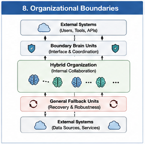

# GTDO-206 — Computational Responsibility Graphs

## Abstract

As Hybrid AI systems evolve into organizations composed of numerous Brain Units and Computational Units, understanding **who is responsible for which computation** becomes increasingly important.

Traditional execution graphs describe computational flow but rarely describe organizational ownership. Goal-Oriented Training Data Organization (GTDO) therefore introduces **Computational Responsibility Graphs (CRGs)**—organizational graphs that explicitly represent the distribution, delegation, inheritance, coordination, and transfer of computational responsibilities throughout runtime.

Rather than focusing solely on execution order, Computational Responsibility Graphs describe **organizational accountability** within Hybrid AI systems.

They answer a different question:

> Which computational organization is responsible for each part of the solution?

This organizational perspective significantly improves explainability, maintainability, validation, and runtime coordination.

---

#### Fig-104-Organizational-Relationships.png

---

#### Fig-108-Organizational-Boundaries.png

---

# Computation Versus Responsibility

Execution and responsibility are related but fundamentally different.

Execution describes:

> What computation happened?

Responsibility describes:

> Who was responsible for making that computation happen?

For example:

Planning Brain Unit

↓

Programming Brain Unit

↓

Validation Brain Unit

Although the Programming Brain Unit generates source code, the Planning Brain Unit may remain responsible for the overall software architecture, while the Validation Brain Unit assumes responsibility for correctness verification.

Execution flows.

Responsibility persists.

---

# What Is a Computational Responsibility Graph?

A Computational Responsibility Graph is an organizational graph whose nodes represent Computational Units or Brain Units, while edges represent responsibility relationships.

Unlike a Calling Graph, which describes execution paths, a Computational Responsibility Graph describes organizational ownership throughout runtime.

It records:

- responsibility assignment
- responsibility delegation
- responsibility inheritance
- responsibility transfer
- collaborative responsibility
- validation responsibility

The graph therefore models organizational structure rather than execution sequence.

---

# Responsibility Assignment

Every significant computational task should have an explicitly assigned owner.

Examples include:

Planning Brain Unit

Responsible for:

- task decomposition
- execution strategy
- organizational coordination

Programming Brain Unit

Responsible for:

- software implementation
- code generation
- refactoring

Validation Brain Unit

Responsible for:

- correctness
- testing
- structural verification

Explicit responsibility greatly improves organizational clarity.

---

# Responsibility Delegation

Brain Units frequently delegate portions of their responsibilities.

For example:

Scientific Brain Unit

↓

Simulation Brain Unit

↓

Visualization Brain Unit

↓

Statistical Analysis Unit

Although execution is delegated, overall responsibility may remain with the originating Scientific Brain Unit.

Delegation therefore differs from ownership transfer.

---

# Responsibility Transfer

Sometimes responsibility itself changes.

Examples include:

Planning completed

↓

Execution begins

↓

Execution Responsibility transferred

↓

Operational Brain Unit

Or

Research completed

↓

Engineering begins

↓

Engineering Brain Unit assumes responsibility

Responsibility transfer represents an organizational transition rather than merely another dispatch decision.

---

# Shared Responsibility

Many complex tasks require multiple Brain Units to share responsibility.

Examples include:

Medical Brain Unit

+

Legal Brain Unit

+

Ethics Brain Unit

↓

Treatment Recommendation

Each Brain Unit contributes expertise while remaining accountable for its own decisions.

The resulting responsibility graph contains multiple incoming responsibility relationships.

Shared responsibility reflects true organizational collaboration.

---

# Responsibility Boundaries

Each Brain Unit possesses clearly defined responsibility boundaries.

Examples include:

Programming Brain Unit

Responsible for:

- implementation

Not responsible for:

- legal compliance

Medical Brain Unit

Responsible for:

- diagnosis

Not responsible for:

- financial optimization

Clear boundaries reduce organizational ambiguity and simplify runtime dispatch.

---

# Responsibility Validation

Responsibility should be verifiable.

For every computational result, runtime should answer questions such as:

- Which Brain Unit produced this result?
- Which unit approved it?
- Which unit validated it?
- Which unit remains accountable?
- Which responsibilities were delegated?

Computational Responsibility Graphs preserve this organizational traceability.

---

# Relationship to Dispatch

Dispatch determines:

> Where should computation go?

Responsibility determines:

> Who owns the outcome?

Multiple dispatches may occur without changing responsibility.

Conversely, responsibility may change without significantly altering execution flow.

Both organizational dimensions are necessary for scalable Hybrid AI.

---

# Relationship to Calling Graphs

Calling Graphs describe:

- execution sequence
- function invocation
- runtime dependencies

Computational Responsibility Graphs describe:

- organizational ownership
- accountability
- delegation
- collaboration
- responsibility evolution

The two graphs complement one another.

Calling Graphs explain execution.

Responsibility Graphs explain organizational governance.

---

# Computational Responsibility in Hybrid AI

As Hybrid AI systems expand, organizational transparency becomes increasingly important.

Computational Responsibility Graphs support:

- explainable AI
- organizational auditing
- runtime governance
- distributed collaboration
- modular engineering
- safety validation

Rather than treating responsibility as implicit, GTDO models it explicitly as an organizational structure.

---

# Relationship to GTDO

Goal-Oriented Training Data Organization organizes computational organizations around reusable responsibilities.

Computational Responsibility Graphs provide the organizational representation that makes these responsibilities visible, manageable, and evolvable.

They transform responsibility from an informal engineering concept into a first-class runtime object.

This enables Hybrid AI systems to reason not only about computation, but also about organizational accountability.

---

# Implications

Future AI systems will increasingly resemble large engineering organizations rather than isolated computational models.

As organizational complexity grows, responsibility management becomes as important as execution management.

Computational Responsibility Graphs provide the missing organizational layer connecting goals, Brain Units, dispatch, validation, and execution into a coherent runtime governance framework.

Together with Dispatch Trees and Calling Graphs, they establish a comprehensive organizational representation for Hybrid AI systems.

---

# Key Takeaways

- Computational Responsibility Graphs represent organizational ownership rather than execution order.
- Responsibility assignment, delegation, transfer, collaboration, and validation are explicitly modeled.
- Responsibility and execution are complementary but distinct organizational concepts.
- Responsibility Graphs improve explainability, governance, traceability, and runtime accountability.
- Calling Graphs describe computational execution, while Responsibility Graphs describe computational ownership.
- Computational Responsibility Graphs provide a foundational organizational framework for Goal-Oriented Training Data Organization and future Hybrid AI architectures.