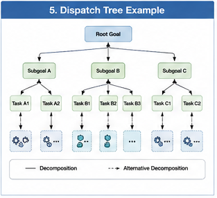

# GTDO-207 — Dispatch Trees

## Abstract

Traditional execution models often represent computation as a sequential pipeline or a function calling graph. While these representations describe execution order, they do not adequately capture how runtime organizations make decisions before computation actually occurs.

Goal-Oriented Training Data Organization (GTDO) introduces **Dispatch Trees** as the organizational structure responsible for decomposing objectives, selecting Computational Units, coordinating Brain Units, and progressively organizing execution.

A Dispatch Tree represents **organizational decision-making** rather than computational execution.

It answers the question:

> Given a goal, how should computation be organized?

Dispatch Trees therefore bridge the gap between high-level objectives and low-level execution.

---

#### Fig-105-Dispatch-Tree-Example.png



---

# Why Dispatch Trees?

Complex computational tasks rarely follow a single predetermined execution path.

Instead, runtime continuously evaluates:

- available Computational Units
- Brain Unit capabilities
- confidence
- significance
- responsibility
- computational cost
- organizational policies

Each evaluation represents a dispatch decision.

Collectively these decisions form an evolving organizational tree.

---

# What Is a Dispatch Tree?

A Dispatch Tree is a hierarchical organizational structure whose nodes represent dispatch decisions rather than executable functions.

Each node determines:

- the current computational objective,
- candidate Computational Units,
- Brain Unit participation,
- responsibility assignment,
- confidence evaluation,
- and subsequent dispatch choices.

Leaves represent executable Computational Units or terminal organizational decisions.

Thus, the Dispatch Tree describes how computation is organized before execution begins.

---

# Organizational Decomposition

Every Dispatch Tree begins with a goal.

For example:

```
User Goal

↓

Understand Request

↓

Retrieve Knowledge

↓

Reason About Results

↓

Generate Response

↓

Validate Output
```

Each level progressively decomposes organizational responsibilities.

The tree therefore transforms abstract objectives into executable computation.

---

# Dispatch Nodes

Every node within a Dispatch Tree represents a runtime organizational decision.

Typical node information includes:

- current objective
- responsible Brain Unit
- candidate Computational Units
- confidence estimate
- significance estimate
- dispatch policy
- boundary evaluation

Unlike execution nodes, dispatch nodes decide **what should happen next**.

---

# Branching Decisions

Multiple computational alternatives frequently exist.

For example:

```
Question

↓

Retrieve

├── Database Search
├── Knowledge Graph
├── Large Language Model
└── External API
```

Runtime evaluates these alternatives according to:

- confidence
- significance
- computational cost
- availability
- organizational policy

The chosen branch becomes part of the active computational organization.

---

# Hierarchical Dispatch

Dispatch naturally occurs at multiple organizational levels.

For example:

Goal Dispatch

↓

Brain Unit Dispatch

↓

Computational Unit Dispatch

↓

Algorithm Dispatch

↓

Execution

Each level refines computational organization while preserving higher-level objectives.

The Dispatch Tree therefore represents hierarchical organizational planning.

---

# Dynamic Tree Evolution

Dispatch Trees are not static.

As runtime progresses:

- new evidence appears,
- confidence changes,
- Brain Units become available,
- goals evolve,
- failures occur,
- validation succeeds or fails.

Consequently, branches may:

- expand,
- contract,
- merge,
- terminate,
- or be reorganized.

The Dispatch Tree continuously evolves alongside runtime computation.

---

# Dispatch Trees and Brain Units

Brain Units may themselves construct internal Dispatch Trees.

For example:

Programming Brain Unit

↓

Architecture Planning

↓

Code Retrieval

↓

Implementation

↓

Testing

↓

Validation

Externally this appears as a single Brain Unit.

Internally it represents another complete organizational tree.

Hybrid AI therefore contains nested Dispatch Trees operating at multiple organizational scales.

---

# Dispatch Trees and General Fallback Units

When no branch satisfies runtime requirements, Dispatch Trees activate alternative organizational strategies.

Examples include:

- fallback dispatch
- broader search
- collaborative reasoning
- additional validation
- human intervention

Rather than terminating computation, the tree expands toward alternative organizational paths.

Fallback therefore becomes a normal branch within the Dispatch Tree.

---

# Dispatch Trees and Responsibility

Each dispatch decision also assigns organizational responsibility.

Every branch records:

- responsible Brain Unit
- delegated responsibilities
- validation ownership
- collaboration requirements

Consequently, Dispatch Trees integrate naturally with Computational Responsibility Graphs.

Dispatch determines organizational structure.

Responsibility determines organizational ownership.

---

# Dispatch Trees Versus Calling Graphs

Although closely related, Dispatch Trees and Calling Graphs describe different aspects of runtime organization.

Dispatch Trees answer:

> How should computation be organized?

Calling Graphs answer:

> What computation was actually executed?

The Dispatch Tree therefore precedes execution.

The Calling Graph records realized execution.

A branch that appears in a Dispatch Tree may never appear in the Calling Graph if runtime selects another alternative.

---

# Dispatch Trees in Hybrid AI

Future Hybrid AI systems may contain thousands of Computational Units distributed across many specialized Brain Units.

Direct execution without organizational planning becomes increasingly inefficient.

Dispatch Trees provide:

- hierarchical planning
- organizational decomposition
- adaptive branching
- Brain Unit coordination
- runtime flexibility
- scalable computational organization

They serve as the organizational blueprint from which execution emerges.

---

# Relationship to GTDO

Goal-Oriented Training Data Organization begins with organizational objectives rather than isolated algorithms.

Dispatch Trees operationalize this philosophy by transforming goals into structured computational organizations.

They connect:

- Goal Functions,
- Brain Units,
- Computational Units,
- Responsibility Graphs,
- Boundary Management,
- and Runtime Execution

into a unified organizational framework.

Dispatch Trees therefore become one of the central organizational representations within GTDO.

---

# Implications

As Hybrid AI systems continue to expand, execution planning will become as important as execution itself.

Dispatch Trees shift AI architecture away from static pipelines and toward adaptive organizational planning.

Instead of asking only how computation should execute, GTDO first asks how computation should organize itself.

This organizational perspective enables scalable, explainable, resilient, and continuously adaptable Hybrid AI systems.

---

# Key Takeaways

- Dispatch Trees represent organizational decision-making rather than computational execution.
- Every node corresponds to a dispatch decision that progressively organizes runtime computation.
- Dispatch Trees hierarchically decompose goals into executable Computational Units.
- They evolve dynamically as runtime conditions, confidence, and objectives change.
- Dispatch Trees coordinate naturally with Brain Units, General Fallback Units, and Computational Responsibility Graphs.
- Dispatch Trees provide the organizational blueprint from which Calling Graphs and runtime execution emerge within Goal-Oriented Training Data Organization.