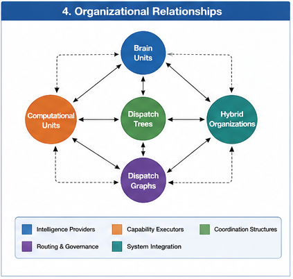
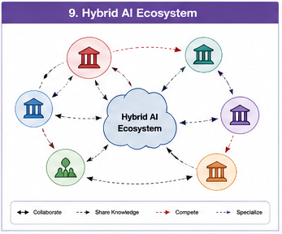

# GTDO-209 — Hybrid Computational Organizations

## Abstract

The evolution of Artificial Intelligence is no longer centered on building increasingly larger individual models. Instead, it is moving toward constructing computational organizations composed of diverse, specialized, and collaborative computational components.

Goal-Oriented Training Data Organization (GTDO) refers to these next-generation systems as **Hybrid Computational Organizations (HCOs)**.

A Hybrid Computational Organization is a runtime organization composed of heterogeneous Brain Units, Computational Units, Dispatch Graphs, Responsibility Graphs, Boundary Brain Units, and General Fallback Units that cooperate to achieve shared computational objectives.

Rather than viewing AI as a single intelligent model, GTDO views intelligence as an emergent property of an organized computational ecosystem.

---

#### Fig-104-Organizational-Relationships.png

---

#### Fig-102-Hybrid-Computational-Organization.png

---

#### Fig-109-Hybrid-AI-Ecosystem.png

---

# Beyond Individual Models

For many years, AI development focused primarily on improving individual models.

Examples include:

- larger neural networks
- larger datasets
- larger parameter counts
- larger context windows

Although these improvements significantly enhanced capability, they did not fundamentally change the organizational structure of computation.

Hybrid Computational Organizations introduce a different perspective.

The objective is no longer:

> Build a larger model.

Instead, the objective becomes:

> Build a better computational organization.

---

# What Is a Hybrid Computational Organization?

A Hybrid Computational Organization is a collection of autonomous computational organizations that cooperate through runtime coordination.

Typical organizational members include:

- Brain Units
- Computational Units
- Boundary Brain Units
- General Fallback Units
- Retrieval Systems
- Planning Systems
- Validation Systems
- External Computational Services

Each organization contributes specialized capabilities while remaining organizationally independent.

---

# Organizational Hierarchy

Hybrid Computational Organizations naturally develop multiple organizational layers.

A typical hierarchy includes:

Global Goal

↓

Dispatch Graph

↓

Brain Units

↓

Dispatch Trees

↓

Computational Units

↓

Algorithms

↓

Runtime Execution

Each layer contributes a different level of organizational abstraction.

Together they form a coherent computational organization.

---

# Organizational Specialization

Different Brain Units specialize in different computational responsibilities.

Examples include:

Programming Organization

- software engineering
- debugging
- architecture

Scientific Organization

- hypothesis generation
- simulation
- experimentation

Medical Organization

- diagnosis
- treatment planning
- validation

Planning Organization

- workflow construction
- scheduling
- optimization

Rather than forcing one model to master every domain, Hybrid Computational Organizations embrace specialization.

---

# Organizational Collaboration

Specialization alone is insufficient.

Complex problems require collaboration.

For example:

Research Brain Unit

↓

Programming Brain Unit

↓

Simulation Brain Unit

↓

Statistical Brain Unit

↓

Validation Brain Unit

↓

Documentation Brain Unit

Each organization contributes unique expertise toward a shared objective.

Collaboration therefore becomes the primary source of computational capability.

---

# Organizational Governance

As organizations become larger, governance becomes essential.

Hybrid Computational Organizations employ:

- Dispatch Graphs
- Computational Responsibility Graphs
- Boundary Brain Units
- Goal Functions
- Validation Policies
- Confidence Evaluation

These organizational mechanisms ensure that collaboration remains coordinated, explainable, and reliable.

Governance transforms distributed computation into organized intelligence.

---

# Runtime Organization

Unlike static software architectures, Hybrid Computational Organizations organize themselves dynamically.

Runtime continuously determines:

- participating Brain Units
- responsibility allocation
- dispatch strategies
- validation requirements
- fallback mechanisms
- resource allocation

The computational organization therefore adapts continuously to changing runtime conditions.

---

# Organizational Evolution

Hybrid Computational Organizations continuously improve.

Evolution occurs through:

- local learning
- Brain Unit specialization
- organizational restructuring
- dispatch optimization
- responsibility refinement
- creation of new Computational Units

Importantly, evolution occurs incrementally.

Entire organizations need not be rebuilt when only one component improves.

This significantly increases scalability and maintainability.

---

# Hybrid Organizations and Collective Intelligence

No individual Brain Unit possesses complete intelligence.

Instead, intelligence emerges through organizational interaction.

Examples include:

- distributed reasoning
- collaborative planning
- shared validation
- cross-domain problem solving
- adaptive dispatch

The overall capability of the organization exceeds the isolated capability of its individual members.

This organizational emergence represents one of the defining characteristics of Hybrid AI.

---

# Relationship to GTDO

Goal-Oriented Training Data Organization provides the organizational methodology for constructing reusable Computational Units and Brain Units.

Hybrid Computational Organizations represent the complete realization of this methodology.

GTDO contributes:

- Goal Functions
- Dispatch Trees
- Dispatch Graphs
- Computational Responsibility Graphs
- Brain Units
- Boundary Brain Units
- General Fallback Units

Together these components form an integrated computational organization capable of solving complex real-world problems.

---

# Relationship to Future Hybrid AI

Hybrid Computational Organizations naturally integrate diverse computational paradigms.

Examples include:

- Large Language Models
- symbolic reasoning
- retrieval systems
- planning engines
- simulation frameworks
- knowledge graphs
- verification systems
- domain-specific Brain Units
- external computational services

Future Hybrid AI systems will likely combine all of these components within unified runtime organizations.

The emphasis shifts from model competition to organizational cooperation.

---

# Toward Computational Ecosystems

As Hybrid Computational Organizations continue to evolve, they begin to resemble computational ecosystems rather than software applications.

Individual organizations may:

- collaborate,
- compete,
- specialize,
- exchange knowledge,
- share Brain Units,
- and collectively improve.

The computational ecosystem becomes increasingly adaptive, resilient, and capable of long-term evolution.

This marks a transition from isolated intelligent systems to continuously evolving intelligent organizations.

---

# Implications

Hybrid Computational Organizations represent a fundamental architectural transition for Artificial Intelligence.

The central engineering challenge is no longer maximizing the capability of a single model, but designing organizations that coordinate many specialized forms of intelligence.

Intelligence therefore becomes an organizational property.

Capability becomes an emergent property of collaboration.

Scalability becomes an organizational engineering problem.

GTDO provides one possible organizational framework for realizing this next stage of Hybrid AI.

---

# Key Takeaways

- Hybrid Computational Organizations consist of cooperating Brain Units, Computational Units, and organizational runtime structures.
- Intelligence emerges through organizational collaboration rather than isolated computational capability.
- Dispatch Graphs, Responsibility Graphs, Boundary Brain Units, and General Fallback Units provide organizational governance.
- Runtime organization dynamically adapts computational structure according to goals and execution context.
- Organizational evolution occurs incrementally through specialization, learning, and structural refinement.
- Hybrid Computational Organizations represent the organizational realization of Goal-Oriented Training Data Organization and a foundational architecture for future Hybrid AI systems.