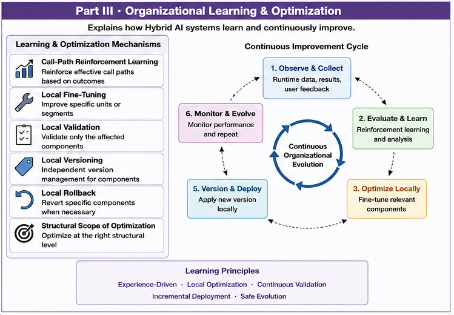

# Part III — Brain Unit Organization

# From Computational Groups to Brain Units

Welcome to **Part III** of the **Goal-Oriented Training Data Organization (GTDO)** repository.

Part I established the conceptual foundations of Goal-Oriented Training Data Organization.

Part II introduced the computational algorithms that organize data according to future computational goals.

Part III takes the next fundamental step.

Rather than treating computational groups as temporary training artifacts, GTDO proposes that they become persistent computational organizations capable of supporting future Runtime AI.

These organizations are referred to as **Brain Units**.

Brain Units provide explicit computational responsibilities, organizational boundaries, dispatch relationships, and cooperative Runtime execution.

---

# Overview

#### Fig-030-Part-III-Organizational-Learning-&-Optimization.png


**Figure 030** summarizes the organizational architecture introduced in Part III.

Individual computational groups evolve into heterogeneous Brain Units that cooperate through explicit organizational structures.

---

# Why This Part Matters

Traditional machine learning typically ends after model training.

GTDO proposes a different perspective.

Training organization should become Runtime organization.

Instead of building one monolithic computational model, GTDO builds multiple specialized computational organizations that cooperate during Runtime execution.

This organizational perspective introduces:

- specialization;
- computational responsibility;
- organizational boundaries;
- explicit dispatch;
- cooperative computation.

Brain Units therefore become the fundamental organizational building blocks of future Runtime AI.

---

# What You Will Learn

After completing this Part, readers should understand:

- how computational groups evolve into Brain Units;
- why heterogeneous computational organizations improve Runtime flexibility;
- how Boundary Brain Units organize uncertain computational regions;
- why General Fallback Units improve robustness;
- how Computational Responsibility Graphs organize collaboration;
- how Dispatch Trees coordinate execution;
- how Dispatch Graphs support complex Runtime interactions;
- how Hybrid Computational Organizations integrate multiple Brain Units into larger Runtime systems.

These concepts establish the organizational architecture used throughout the remainder of the repository.

---

# Articles

| ID | Title |
|----|-------|
| **GTDO-201** | From Training Groups to Computational Units |
| **GTDO-202** | Heterogeneous Computational Units |
| **GTDO-203** | Brain Units |
| **GTDO-204** | Boundary Brain Units |
| **GTDO-205** | General Fallback Units |
| **GTDO-206** | Computational Responsibility Graphs |
| **GTDO-207** | Dispatch Trees |
| **GTDO-208** | Dispatch Graphs |
| **GTDO-209** | Hybrid Computational Organizations |

---

# Reading Suggestions

The recommended reading order is:

```
GTDO-201

↓

GTDO-202

↓

GTDO-203

↓

GTDO-204

↓

GTDO-205

↓

GTDO-206

↓

GTDO-207

↓

GTDO-208

↓

GTDO-209
```

The articles progress naturally from individual computational units toward cooperative organizational ecosystems.

---

# Relationship to Other Parts

Part III represents the organizational center of the GTDO framework.

```
Part I

Foundations

        ↓

Part II

Core Grouping Algorithms

        ↓

Part III

Brain Unit Organization

        ↓

Part IV

Call Path Optimization
```

The first two Parts explain why and how computation should be organized.

Part III explains how organized computation becomes a cooperative Runtime architecture.

---

# Key Contributions

Part III introduces several organizational concepts that distinguish GTDO from conventional AI architectures.

Highlights include:

- Computational Units
- Heterogeneous Organizations
- Brain Units
- Boundary Brain Units
- General Fallback Units
- Computational Responsibility Graphs
- Dispatch Trees
- Dispatch Graphs
- Hybrid Computational Organizations

Together these concepts transform computational groups into reusable organizational assets.

---

# Relationship to Runtime AI

Brain Units are not isolated computational modules.

They are organizational entities capable of cooperating during Runtime execution.

Later, in Part IV,

these Brain Units are connected through:

- Calling Graphs;
- Call Paths;
- localized Runtime optimization;
- Runtime validation;
- structural security infrastructure.

Part III therefore establishes the organizational layer connecting computational grouping and Runtime execution.

---

# Key Takeaways

Part III establishes several important organizational principles.

- Computational groups evolve into Brain Units.
- Specialization improves Runtime efficiency.
- Organizational boundaries enable scalable computation.
- Dispatch structures coordinate cooperative execution.
- Responsibility Graphs improve explainability and maintainability.
- Hybrid organizations integrate heterogeneous computational capabilities.

These principles establish the organizational architecture of GTDO.

---

# Continue Your Journey

After completing **Part III**, continue to:

> **Part IV — Call Path Optimization**

where Brain Units cooperate through Calling Graphs, Runtime execution paths, localized optimization, Runtime validation, and Structural Security Infrastructure.

The transition from Part III to Part IV represents the evolution from **computational organizations** to **organized Runtime intelligence**.