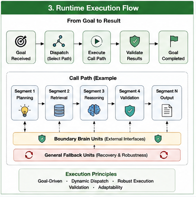
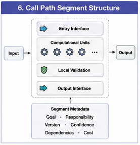
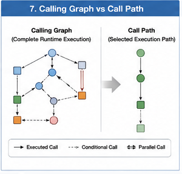

# GTDO-303 — Call Path Segments

## Abstract

A Call Path describes the complete sequence of computational organizations involved in solving a task. As Hybrid AI systems become increasingly modular and distributed, however, complete Call Paths grow longer, more dynamic, and more reusable.

Goal-Oriented Training Data Organization (GTDO) introduces **Call Path Segments (CPSs)** as reusable structural components of larger Call Paths.

Rather than treating every execution path as a single continuous sequence, GTDO decomposes runtime execution into meaningful organizational segments that can be analyzed, optimized, validated, reused, and independently evolved.

Call Path Segments therefore become the modular building blocks of future runtime organizations.

---

#### Fig-103-Runtime-Execution-Flow.png

---

#### Fig-106-Call-Path-Segment-Structure.png

---

#### Fig-107-Calling-Graph-vs-Call-Path.png

---

# Why Segment Call Paths?

Large computational workflows often involve hundreds or thousands of execution steps.

For example:

User Request

↓

Planning

↓

Retrieval

↓

Reasoning

↓

Simulation

↓

Validation

↓

Generation

↓

Verification

↓

Response

Optimizing such a long execution path as one monolithic structure is difficult.

Instead, GTDO divides execution into manageable organizational segments.

---

# What Is a Call Path Segment?

A Call Path Segment is a coherent portion of a larger Call Path that performs a well-defined organizational objective.

A segment may contain:

- multiple Computational Units
- one or more Brain Units
- Dispatch Trees
- validation procedures
- local decision points

Externally, however, it behaves as a single reusable execution component.

---

# Organizational Cohesion

Each Call Path Segment should possess strong internal cohesion.

Typical segment objectives include:

Planning Segment

- understand objectives
- decompose tasks
- allocate responsibilities

Retrieval Segment

- locate information
- rank candidates
- collect evidence

Reasoning Segment

- derive conclusions
- compare alternatives
- resolve ambiguity

Validation Segment

- verify correctness
- evaluate confidence
- approve results

Each segment performs one major organizational function.

---

# Segment Boundaries

Segments naturally begin and end at organizational transitions.

Typical boundary conditions include:

- responsibility transfer
- Brain Unit transition
- dispatch completion
- validation checkpoint
- goal completion
- fallback activation

These boundaries simplify runtime organization and improve modularity.

---

# Segment Reuse

One of the greatest advantages of segmentation is reuse.

For example:

Retrieval Segment

may support:

- scientific research
- legal analysis
- software engineering
- medical diagnosis
- education

The segment itself remains unchanged.

Only its surrounding organizational context changes.

Segment reuse significantly reduces engineering effort.

---

# Segment Composition

Complex Call Paths emerge through the composition of multiple segments.

For example:

Planning Segment

↓

Knowledge Retrieval Segment

↓

Reasoning Segment

↓

Simulation Segment

↓

Validation Segment

↓

Response Generation Segment

Rather than designing complete execution paths from scratch, runtime organizations assemble existing segments according to current objectives.

---

# Local Optimization

Optimization often occurs more effectively at the segment level.

Examples include:

Planning Segment

- improved task decomposition

Retrieval Segment

- better ranking algorithms

Validation Segment

- stronger verification policies

Because optimization remains localized, improvements can be introduced without redesigning the entire Call Path.

---

# Independent Evolution

Different Call Path Segments evolve independently.

Examples include:

Programming Segment

updated weekly

↓

Simulation Segment

updated monthly

↓

Medical Validation Segment

updated continuously

The complete organizational workflow remains stable despite ongoing local improvements.

Segment independence greatly improves maintainability.

---

# Segment Validation

Validation naturally occurs at segment boundaries.

Each completed segment may produce:

- outputs
- confidence estimates
- significance estimates
- responsibility records
- execution metadata

These checkpoints allow runtime organizations to detect problems before computation propagates further.

Validation therefore becomes incremental rather than deferred until the end of execution.

---

# Segment Libraries

As Hybrid AI organizations mature, reusable segment libraries naturally emerge.

Examples include:

Planning Library

Retrieval Library

Reasoning Library

Simulation Library

Validation Library

Documentation Library

Runtime organizations construct new workflows by assembling these reusable organizational assets.

This resembles software engineering libraries, but at the level of computational organizations rather than individual functions.

---

# Relationship to Dispatch Trees

Dispatch Trees determine:

> How computation should be organized.

Call Path Segments represent:

> The reusable execution organizations produced by those dispatch decisions.

Multiple Dispatch Trees may generate identical Call Path Segments.

Likewise, one Call Path Segment may appear in many different Dispatch Graphs.

---

# Relationship to Calling Graphs

Calling Graphs describe complete runtime execution.

Call Path Segments partition Calling Graphs into meaningful organizational modules.

This decomposition makes execution:

- easier to analyze,
- easier to optimize,
- easier to validate,
- easier to reuse,
- and easier to evolve.

Segments therefore provide the modular structure inside larger Calling Graphs.

---

# Call Path Segments in Hybrid AI

Future Hybrid AI systems will execute increasingly complex organizational workflows.

Managing these workflows as monolithic execution paths becomes impractical.

Call Path Segments introduce a modular organizational layer that supports:

- reusable computation
- distributed execution
- localized optimization
- incremental validation
- scalable engineering
- organizational evolution

They enable runtime organizations to behave more like well-engineered enterprises than linear software pipelines.

---

# Relationship to GTDO

Goal-Oriented Training Data Organization emphasizes reusable computational organizations.

Call Path Segments extend this philosophy into runtime execution.

Rather than organizing isolated function calls, GTDO organizes reusable execution structures that can be independently developed, validated, optimized, and recombined.

This transforms runtime execution into a modular organizational architecture.

---

# Implications

The future of Hybrid AI depends not only on stronger Brain Units but also on reusable execution organizations.

Call Path Segments provide this missing intermediate abstraction between individual Computational Units and complete Calling Graphs.

They encourage engineering practices based on modularity, composability, continuous improvement, and organizational reuse.

Together with Dispatch Trees, Dispatch Graphs, and Calling Graphs, Call Path Segments establish a scalable runtime architecture for Hybrid AI organizations.

---

# Key Takeaways

- Call Path Segments are reusable organizational components within larger Call Paths.
- Each segment performs a coherent computational objective with strong internal cohesion.
- Segment boundaries naturally occur at responsibility transfers, validation checkpoints, and dispatch transitions.
- Segments support independent optimization, validation, evolution, and reuse.
- Calling Graphs are naturally decomposed into modular Call Path Segments.
- Call Path Segments provide a foundational runtime abstraction for Goal-Oriented Training Data Organization and future Hybrid AI systems.