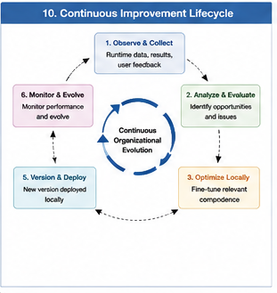
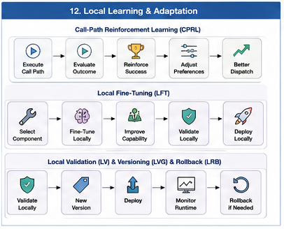

# GTDO-305 — Local Fine-Tuning

## Abstract

Traditional AI systems frequently improve performance by retraining or fine-tuning an entire model. As models become increasingly large and Hybrid AI systems become increasingly modular, this global optimization strategy becomes computationally expensive, difficult to validate, and potentially disruptive to previously learned capabilities.

Goal-Oriented Training Data Organization (GTDO) introduces **Local Fine-Tuning (LFT)** as an organizational learning strategy in which improvements are applied only to the Computational Units, Brain Units, or Call Path Segments directly responsible for a particular capability.

Rather than optimizing an entire Hybrid AI system, Local Fine-Tuning targets the smallest organizational component capable of producing the desired improvement.

Learning therefore becomes localized, modular, explainable, and continuously deployable.

---

#### Fig-110-Continuous-Improvement-Lifecycle.png

---

#### Fig-112-Local-Learning-and-Adaptation.png

---

# Beyond Global Fine-Tuning

Conventional fine-tuning generally assumes that a single model represents the primary computational asset.

A typical workflow is:

Model

↓

New Training Data

↓

Fine-Tuning

↓

Updated Model

Although effective for monolithic architectures, this approach presents several challenges.

Global updates may:

- modify unrelated capabilities,
- introduce regressions,
- require extensive retraining,
- invalidate previous testing,
- increase deployment complexity.

As Hybrid AI organizations grow, global optimization becomes increasingly inefficient.

---

# What Is Local Fine-Tuning?

Local Fine-Tuning applies learning only to the organizational component directly associated with the observed deficiency or improvement opportunity.

Possible optimization targets include:

- Computational Units
- Brain Units
- Dispatch policies
- Call Path Segments
- Validation Units
- Boundary Brain Units
- General Fallback Units

Only the affected organizational component is updated.

The remainder of the computational organization continues operating unchanged.

---

# Principle of Locality

Every computational capability should possess an identifiable organizational owner.

For example:

Programming Brain Unit

↓

Code Completion Unit

↓

Syntax Validation Unit

↓

Documentation Unit

If code completion quality decreases, only the Code Completion Unit requires optimization.

There is no organizational reason to retrain unrelated components.

GTDO therefore follows the principle:

> Optimize where the problem exists.

---

# Capability-Centered Learning

Local Fine-Tuning focuses on capabilities rather than models.

Examples include:

Improving:

- planning quality
- retrieval accuracy
- mathematical reasoning
- validation consistency
- dispatch efficiency
- documentation generation

Each improvement targets the organizational component responsible for that capability.

Capability-centered optimization significantly reduces unnecessary computation.

---

# Local Fine-Tuning of Brain Units

Entire Brain Units may evolve independently.

For example:

Programming Brain Unit

↓

Updated software engineering corpus

↓

Improved implementation quality

Other Brain Units remain unchanged:

- Medical Brain Unit
- Scientific Brain Unit
- Planning Brain Unit
- Legal Brain Unit

Organizational independence enables parallel evolution.

---

# Fine-Tuning Call Path Segments

Sometimes the problem lies not within individual Computational Units but within their collaboration.

Examples include:

Planning Segment

↓

Retrieval Segment

↓

Reasoning Segment

↓

Validation Segment

If the Retrieval Segment becomes inefficient, Local Fine-Tuning improves only that reusable organizational segment.

The remaining workflow continues unchanged.

---

# Dispatch Optimization

Learning may also improve dispatch rather than computational capability.

Examples include:

- better Brain Unit selection
- improved Boundary Brain Unit coordination
- more efficient fallback activation
- optimized Dispatch Trees
- improved Dispatch Graph routing

Local Fine-Tuning therefore extends beyond model parameters into organizational behavior.

---

# Advantages of Local Fine-Tuning

Compared with global retraining, Local Fine-Tuning provides several important advantages.

## Faster Learning

Only relevant components require optimization.

## Reduced Computational Cost

Training resources remain localized.

## Improved Explainability

The source of improvement is clearly identifiable.

## Lower Risk

Unrelated capabilities remain unaffected.

## Continuous Deployment

Updates may be introduced incrementally.

## Better Maintainability

Independent organizational components evolve separately.

These advantages become increasingly valuable as Hybrid AI organizations grow.

---

# Relationship to Reinforcement Learning

Call-Path Reinforcement Learning identifies:

> Which organizational structures should improve.

Local Fine-Tuning performs:

> The actual improvement.

Reinforcement determines organizational direction.

Fine-Tuning performs organizational refinement.

Together they establish a continuous improvement cycle.

---

# Relationship to Validation

Local improvements require local validation.

Following optimization, only the modified organizational components require comprehensive testing.

Validation may include:

- functional correctness
- confidence evaluation
- performance measurement
- organizational compatibility
- dispatch verification

This dramatically reduces validation effort compared with global retraining.

---

# Local Evolution of Hybrid AI

Hybrid AI organizations naturally evolve component by component.

Examples include:

Monday

↓

Programming Brain Unit updated.

Tuesday

↓

Retrieval Segment optimized.

Wednesday

↓

Dispatch policy improved.

Thursday

↓

Validation Brain Unit enhanced.

The entire computational organization evolves continuously without requiring large-scale reconstruction.

---

# Relationship to GTDO

Goal-Oriented Training Data Organization emphasizes reusable computational organizations with clearly defined responsibilities.

Local Fine-Tuning extends this philosophy by ensuring that learning follows the same organizational structure.

Rather than treating the Hybrid AI system as one indivisible model, GTDO enables every organizational component to evolve independently while preserving overall organizational stability.

---

# Implications

As AI systems continue to expand, continuous improvement will become an organizational engineering problem rather than a model-training problem.

Local Fine-Tuning provides a scalable methodology for evolving large Hybrid AI systems through incremental, explainable, and modular improvements.

Instead of periodically rebuilding intelligence, future systems may continuously refine individual organizational components while maintaining uninterrupted runtime operation.

This capability represents one of the defining engineering principles of organizational AI.

---

# Key Takeaways

- Local Fine-Tuning optimizes individual organizational components rather than entire AI systems.
- Computational Units, Brain Units, Dispatch policies, and Call Path Segments may all evolve independently.
- Learning follows organizational responsibility rather than model boundaries.
- Local optimization reduces computational cost, deployment risk, and validation effort.
- Local Fine-Tuning complements Call-Path Reinforcement Learning by implementing targeted organizational improvements.
- Local Fine-Tuning is a foundational engineering mechanism for Goal-Oriented Training Data Organization and future Hybrid AI organizations.