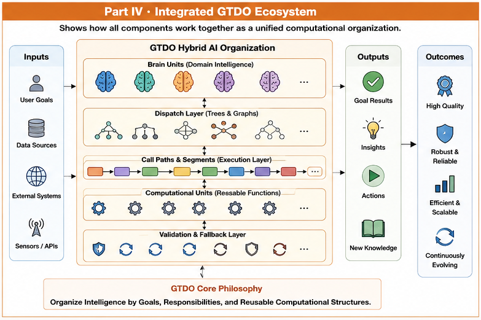

# Part IV — Call Path Optimization

# From Runtime Execution to Trustworthy AI

Welcome to **Part IV** of the **Goal-Oriented Training Data Organization (GTDO)** repository.

Part IV concludes the GTDO framework by focusing on Runtime execution.

After establishing computational organizations and Brain Units in the previous Parts, this Part studies how these organizations cooperate during Runtime through Calling Graphs, Call Paths, localized optimization, Runtime validation, and Structural Security Infrastructure.

Rather than treating Runtime execution as a sequence of isolated model inferences, GTDO views Runtime as an explicitly organized computational ecosystem capable of continual learning, adaptation, and controlled evolution.

---

# Overview

#### Fig-040-Part-IV-Integrated-GTDO-Ecosystem.png


**Figure 040** summarizes the complete Runtime ecosystem developed throughout Part IV.

Brain Units cooperate through Calling Graphs and Call Paths, enabling localized optimization while preserving structural stability and organizational responsibility.

---

# Why This Part Matters

Traditional AI systems often optimize an entire model as a single computational unit.

GTDO proposes a different Runtime philosophy.

Instead of globally optimizing one monolithic system,

GTDO performs localized optimization along explicitly organized execution paths.

This organizational perspective enables:

- localized Runtime learning;
- modular optimization;
- organizational validation;
- version control;
- rollback;
- structural responsibility;
- trustworthy Runtime execution.

Optimization therefore becomes an organizational process rather than a purely numerical process.

---

# What You Will Learn

After completing this Part, readers should understand:

- how Dispatch Trees evolve into Calling Graphs;
- how Call Paths organize Runtime execution;
- why execution should be optimized locally;
- how localized reinforcement improves Runtime adaptability;
- why validation should occur at organizational boundaries;
- how versioning and rollback support continual evolution;
- how optimization scope should remain structurally controlled;
- why structural organization forms the foundation of trustworthy Runtime AI.

These ideas complete the organizational lifecycle introduced throughout GTDO.

---

# Articles

| ID | Title |
|----|-------|
| **GTDO-301** | Dispatch Trees as Calling Graphs |
| **GTDO-302** | Call Paths |
| **GTDO-303** | Call Path Segments |
| **GTDO-304** | Call-Path Reinforcement Learning |
| **GTDO-305** | Local Fine-Tuning |
| **GTDO-306** | Local Validation |
| **GTDO-307** | Local Versioning |
| **GTDO-308** | Local Rollback |
| **GTDO-309** | Structural Scope of Optimization |
| **GTDO-310** | GTDO as the Structural Security Infrastructure for AI Runtime |

---

# Reading Suggestions

The recommended reading order is:

```
GTDO-301

↓

GTDO-302

↓

GTDO-303

↓

GTDO-304

↓

GTDO-305

↓

GTDO-306

↓

GTDO-307

↓

GTDO-308

↓

GTDO-309

↓

GTDO-310
```

The articles progress from Runtime execution structures toward continual optimization and trustworthy AI.

---

# Relationship to Other Parts

Part IV completes the organizational evolution developed throughout the repository.

```
Part I

Foundations

        ↓

Part II

Core Grouping Algorithms

        ↓

Part III

Brain Unit Organization

        ↓

Part IV

Call Path Optimization
```

The first three Parts organize computation.

Part IV organizes Runtime evolution.

---

# Key Contributions

Part IV introduces several Runtime concepts that distinguish GTDO from conventional AI architectures.

Highlights include:

- Calling Graphs
- Call Paths
- Call Path Segments
- Local Reinforcement Learning
- Local Fine-Tuning
- Local Validation
- Local Versioning
- Local Rollback
- Structural Scope of Optimization
- Structural Security Infrastructure

Together these concepts establish a Runtime organizational framework capable of continual improvement while preserving structural consistency.

---

# Relationship to Trustworthy Runtime AI

The final articles extend GTDO beyond computational organization.

They demonstrate that trustworthy AI does not begin with stronger filters or larger models.

Instead, trustworthy Runtime AI emerges from:

- explicit organizational boundaries;
- controlled dispatch;
- localized Runtime validation;
- structural responsibility;
- continuous organizational learning.

GTDO therefore proposes organizational structure as the first layer of Runtime trust.

---

# Key Takeaways

Part IV establishes several fundamental Runtime principles.

- Runtime execution should be explicitly organized.
- Calling Graphs coordinate organizational computation.
- Call Paths enable localized optimization.
- Validation should accompany continual learning.
- Versioning and rollback support safe evolution.
- Optimization should remain structurally bounded.
- Trustworthy AI begins with structural organization.

These principles complete the organizational framework of GTDO.

---

# Completing the GTDO Journey

The complete organizational evolution developed throughout GTDO can now be summarized as:

```
Training Data

↓

Goal Functions

↓

Computational Organization

↓

Brain Units

↓

Dispatch

↓

Calling Graphs

↓

Call Paths

↓

Local Runtime Learning

↓

Runtime Validation

↓

Structural Security Infrastructure

↓

Trustworthy Runtime AI
```

GTDO therefore proposes that future AI systems should evolve not only through larger models and larger datasets, but through progressively better computational organization.

---

# Beyond GTDO

Part IV intentionally concludes with **GTDO-310**.

The purpose of this final article is not to establish a complete AI security theory, but to identify an important future research direction.

GTDO argues that structural organization is a necessary prerequisite for trustworthy Runtime AI.

Future studies may further investigate:

- Runtime Structural Interaction;
- Runtime Governance;
- Runtime Invariant Validation;
- Organizational Trust;
- Human–AI Collective Runtime;
- Hybrid Runtime Intelligence.

GTDO provides the organizational infrastructure upon which these future theories may be developed.

---

# Congratulations

You have completed the complete GTDO framework.

Beginning with the organization of training data,

and ending with trustworthy Runtime AI,

GTDO demonstrates that computational organization is not merely an implementation detail.

It is a fundamental architectural principle for future AI systems.

Thank you for exploring the organizational foundations of Runtime AI.